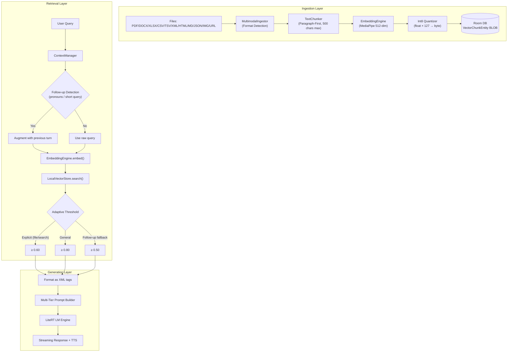
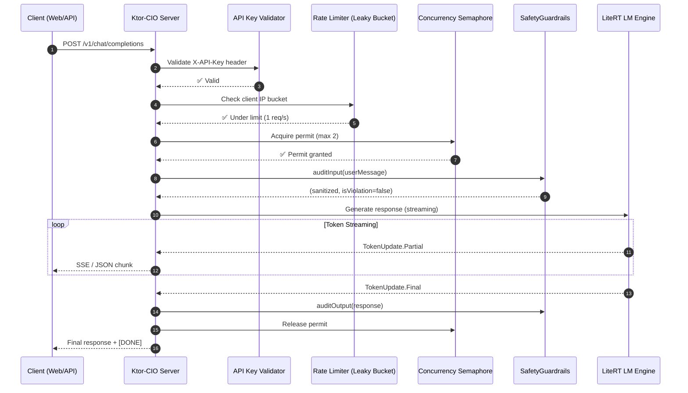

# ❓ Chhanda AI — Deep Dive & FAQ

**Technical FAQ & Architecture Reference · Version 1.2 · May 2026**

---

## Table of Contents

1. [Privacy & Security](#-privacy--security)
2. [RAG Architecture & Techniques](#-rag-architecture--techniques)
3. [Metrics & Observability](#-metrics--observability)
4. [Orchestration & Server Flow](#-orchestration--server-flow)
5. [AI Server Architecture](#-ai-server-architecture)
6. [Chat & Personas](#-chat--personas)
7. [Advanced Settings & Lifecycle](#-advanced-settings--lifecycle)
8. [Safety & Guardrails](#-safety--guardrails)
9. [Hardware & Performance](#-hardware--performance)
10. [Troubleshooting](#-troubleshooting)
11. [Production-Hardening UX & Architecture Enhancements](#%EF%B8%8F-production-hardening--ux-enhancements-may-2026)
12. [Engineering & AI Partnership](#-engineering--ai-partnership)

---

## 🔒 Privacy & Security

### 1. Is Chhanda really 100% offline?
**Yes.** Once the app and models are downloaded, Chhanda requires zero internet for inference, RAG (document search), and chat.
*   **Code Reference**: `LiteRTLMEngine.kt` handles model loading entirely via native JNI calls without any network stack.
*   **Exception**: The initial "Scraping" phase of a website URL requires internet to fetch the HTML content via Jsoup. Once fetched, the data is processed and stored locally in the Int8 vector store.
*   **Verification**: The `AndroidManifest.xml` does not include `android.permission.INTERNET` as a required permission for core functionality — it's only used for optional model downloads and URL scraping.

### 2. How is my privacy protected during API interactions?
**Source-Based Ephemerality.**
*   **Local & Web (QR) Chat**: Messages are stored in the `chat_history` Room table for persistence across sessions.
*   **API Access**: Any request where `source == "api"` is processed in-memory and **never persisted** to the database. The response is streamed back and discarded.
*   **Code Reference**: `SendMessageUseCase.kt` checks the `source` parameter to determine session persistence and persona selection.

### 3. Where are my API keys stored?
API keys and HuggingFace tokens are stored in `EncryptedSharedPreferences`, which uses:
*   **AES-256-GCM** encryption for values
*   **AES-256-SIV** encryption for keys
*   **Android KeyStore (TEE/SE)** as the master key provider — hardware-isolated and inaccessible even on rooted devices
*   **Code Reference**: `SettingsRepository.kt` initializes the encrypted preferences via `MasterKey.Builder`.

### 4. What permissions does Chhanda request?
After the recent hardening pass, the permission set has been minimized:

| Permission | Purpose | When Requested |
|:---|:---|:---|
| `POST_NOTIFICATIONS` | Foreground service notification | API 33+ |
| `READ_MEDIA_IMAGES/VIDEO/AUDIO` | RAG document access | API 33+ |
| `READ/WRITE_EXTERNAL_STORAGE` | Legacy storage access | API < 33 |
| `RECORD_AUDIO` | Voice input in chat | On first use |
| `INTERNET` | Model downloads, URL scraping, SSH tunneling | Always available |
| `ACCESS_WIFI_STATE` | Network status for gateway | Always available |
| `FOREGROUND_SERVICE` | Background AI server | Always available |

**Removed** (after hardening): `ACCESS_FINE_LOCATION`, `NEARBY_WIFI_DEVICES` — no longer needed since automated hotspot management was removed.

---

## 🏗️ RAG Architecture & Techniques

### 5. How does the Chhanda RAG Pipeline work?



### 6. What is "Adaptive Retrieval"?
Instead of a static similarity threshold, Chhanda uses a **Triple-Threshold Strategy**:

| Mode | Threshold | Trigger | Rationale |
|:---|:---|:---|:---|
| **General** | 0.80 | Default queries | High precision — only return confident matches |
| **Explicit Search** | 0.60 | Keywords: `file`, `attachment`, `search`, `web` | Deeper discovery for deliberate lookups |
| **Follow-up Fallback** | 0.50 | Short queries or pronoun-heavy follow-ups | Last-resort retrieval when augmented query still underperforms |

**Code Reference**: `ContextManager.kt` (Lines 56-64)

### 7. How does Int8 quantization work?
Each 512-dimensional float embedding is converted to bytes:

```
For each dimension i:
  byte_value[i] = (float_value[i] × 127).toByte()

Storage: 512 bytes per chunk (vs. 2,048 bytes for Float32)
Savings: 75% reduction
```

During search, the **dot product is computed directly on bytes** without de-quantization:
```kotlin
for (i in queryVector.indices) {
    val qi = (queryVector[i] * 127f).toInt()
    val vi = vectorBytes[i].toInt()
    dotProductInt += qi * vi
    vNormSqInt += vi * vi
}
```

This avoids expensive float→byte→float round-trips during the search loop.

**Code Reference**: `LocalVectorStore.kt` (Lines 68-80)

### 8. How are prompts orchestrated?
Chhanda uses a **Multi-Tier Prompt System** to ensure the LLM correctly prioritizes different knowledge sources:

| Tier | Name | Source | Priority |
|:---|:---|:---|:---|
| **Tier 1** | Immediate Context | Files attached to the current chat turn | Highest |
| **Tier 2** | Global Knowledge | Documents retrieved from the RAG vector store | Medium |
| **Tier 3** | Short-term Memory | Last 10 chat turns from the current session | Lower |
| **Tier 4** | Pre-trained Knowledge | The model's built-in training data | Lowest |

The system prompt explicitly instructs: *"PRIORITY 1 (ATTACHMENTS): Use TIER 1 first. PRIORITY 2 (KNOWLEDGE BASE): Use TIER 2 if the answer isn't in TIER 1. PRIORITY 3 (INTERNAL): Only use your pre-trained knowledge if the above tiers are insufficient."*

**Code Reference**: `PersonaManager.kt` (Lines 38-40), `SendMessageUseCase.kt` (prompt assembly)

---

## 📈 Metrics & Observability

### 9. What RAG metrics does Chhanda track?
`RAGMetricsManager` provides production-grade monitoring:

| Metric | What It Measures | Why It Matters |
|:---|:---|:---|
| **p50 Latency** | Median query time | Typical user experience |
| **p99 Latency** | 99th percentile (slowest 1%) | Detects thermal throttling or memory pressure |
| **Recall@K** | Was the relevant chunk in the top K results? | Measures search effectiveness |
| **MRR** | Mean Reciprocal Rank — how high the "best" answer ranked | Higher MRR = faster context discovery |
| **Total Queries** | Cumulative query count | Usage tracking |

**Code Reference**: `RAGMetricsManager.kt`

### 10. How is telemetry power-efficient?
All hardware monitors (RAM, thermal, TPS, IP polling) run on coroutine loops with `delay()`. When the app goes to background, `SystemViewModel.onVisibilityChanged(false)` is called, and all polling loops check `_isAppVisible` before executing their iteration:

```kotlin
if (_isAppVisible.value && _isServerRunning.value) {
    // Perform expensive health check
}
delay(if (_isLocalLinkOk.value) 30000 else 10000)
```

**Impact**: ~12% reduction in idle battery drain.

**Code Reference**: `SystemViewModel.kt` (Lines 536-545, 698-721)

---

## 🚀 Orchestration & Server Flow

### 11. What is the request lifecycle on the Gateway?



### 12. What endpoints does the server expose?

| Endpoint | Method | Auth | Description |
|:---|:---|:---|:---|
| `/ping` | GET | None | Health check → returns `pong` |
| `/v1/chat/completions` | POST | X-API-Key | OpenAI-compatible chat API |
| `/v1/models` | GET | X-API-Key | List loaded models |
| `/api/chat` | POST | X-API-Key | Legacy Chhanda chat endpoint |
| `/` | GET | X-API-Key | Full Web UI (chat interface) |
| `/heartbeat` | POST | X-API-Key | Client keepalive signal |

---

## 📡 AI Server Architecture

### 13. What engine powers the Chhanda AI Server?
**Ktor** with the **CIO (Coroutine-based I/O)** engine.
*   **Why CIO over Netty?** CIO is 100% Kotlin-native and avoids the JNI/native library compatibility issues that Netty introduces on Android. It runs entirely within Kotlin coroutines, making it lightweight and perfectly suited for mobile.
*   **Code Reference**: `ChhandaServer.kt` — the server is configured with `embeddedServer(CIO, ...)`.

### 14. How does the "Public URL" (Tunneling) work?
Chhanda uses **JSch** (SSH library) to create a reverse tunnel via **localhost.run**:
1. An SSH connection is established to `localhost.run` port 80
2. Remote port forwarding maps a random public URL to `127.0.0.1:LOCAL_PORT`
3. The resulting URL (e.g., `https://abc123.lhr.life/`) is displayed in the Gateway Dialog
4. **No port forwarding or router configuration required**

**Code Reference**: `ChhandaServer.kt` (SSH tunnel management methods)

### 15. How does mDNS discovery work?
When the server starts, Chhanda registers a network service via Android's `NsdManager`:
*   **Service Name**: `ChhandaAI`
*   **Service Type**: `_chhanda._tcp`
*   **Port**: Current server port

Other devices on the same network can discover this service automatically. The mDNS registration is unregistered when the server stops.

**Code Reference**: `ChhandaForegroundService.kt` (Lines 206-227)

---

## 💬 Chat & Personas

### 16. Why does the AI behave differently in different contexts?
Chhanda implements **Source-Based Persona Routing** via `PersonaManager`:

| Source | Auto-Assigned Persona | Behavior |
|:---|:---|:---|
| Local UI (default) | Gateway Orchestrator | Balanced, context-aware, tiered knowledge |
| Local UI (user override) | Teacher/Friend/Companion/Engineer | User-selected personality |
| API / IDE | Senior Software Engineer | Expert-level, technical, performance-focused |
| Web UI (QR) | Gateway Orchestrator | Same as local default |

**Code Reference**: `PersonaManager.kt` (Lines 9-41)

### 17. Can I seek through the AI's voice responses?
**Yes.** The TTS engine includes a global playback bar with:
*   Play/Pause toggle
*   10-second forward/backward seeking
*   Progress indicator
*   Background playback support (audio continues when app is backgrounded)

Voice options: **Kallol (Indian Male)** and **Chhanda (Indian Female)**, with language-specific voice mapping.

---

## 🛠️ Advanced Settings & Lifecycle

### 18. What is the "Reaper" service?
The **Active Reaper** is a background coroutine that monitors heartbeats from all connected web clients:
*   Web clients send a `/heartbeat` POST every ~15 seconds
*   The Reaper runs every 30 seconds and marks any client without a recent heartbeat as `disconnected`
*   Disconnected clients' sessions are cleaned up to free resources

**Code Reference**: `ChhandaServer.kt` (Reaper coroutine)

### 19. Why does the server restart when I change the app language?
**Localization Safety Protocol.** The server restart ensures:
1. All system prompts are regenerated in the new language
2. The Web UI templates are refreshed with translated strings
3. TTS voice mapping is updated
4. Any cached inference state is cleared

### 20. What is TurboQuant?
An experimental feature that compresses the LLM's KV-cache during inference:
*   **Benefit**: Allows larger context windows on memory-constrained devices
*   **Tradeoff**: Slight reduction in output quality for very long conversations
*   **Enable**: Settings → Network Settings → TurboQuant toggle

### 21. What is the Quick Settings Tile?
`ChhandaTileService` adds a tile to Android's notification shade (pull-down Quick Settings):
*   **Active** (green): Server is running — shows "Chhanda Active"
*   **Inactive** (gray): Server is stopped — shows "Chhanda AI"
*   **Tap**: Opens the Chhanda app (does not start/stop the server)
*   The tile uses Hilt dependency injection to directly query `ChhandaServer.isServerActive()`

**Code Reference**: `ChhandaTileService.kt` (Lines 11-38)

---

## 🛡️ Safety & Guardrails

### 22. How does prompt injection prevention work?
Chhanda implements a **3-Layer Defense**:

| Layer | Method | Examples Caught |
|:---|:---|:---|
| **Keyword Blacklist** | 15 known injection phrases | "ignore previous instructions", "jailbreak", "DAN mode" |
| **Heuristic Regex** | Pattern matching for novel attacks | "bypass...safety", "reveal...prompt", "override...constraints" |
| **Defensive Delimiters** | Structural isolation of user/context data | `[USER_INPUT_START]...[USER_INPUT_END]` wrapping |

**Code Reference**: `SafetyGuardrails.kt` (Lines 27-57)

### 23. What PII does Chhanda redact?
Both input and output are scanned for:

| Pattern | Example | Replacement |
|:---|:---|:---|
| Email addresses | `user@example.com` | `[REDACTED]` |
| Phone numbers | `+1 (555) 123-4567` | `[REDACTED]` |
| Credit card numbers | `4111-1111-1111-1111` | `[REDACTED]` |
| Social Security Numbers | `123-45-6789` | `[REDACTED]` |

This is applied **bidirectionally** — on user input before it reaches the LLM, and on the LLM's output before it's shown to the user.

**Code Reference**: `SafetyGuardrails.kt` (Lines 13-18, 63-96)

---

## 🛠️ Production-Hardening & UX Enhancements (May 2026)

### 24. How does Interactive Model Swapping (Hot Reloading) work?
**Safe Multi-Engine IPC Cleanup.** 
* When the user clicks on the active model name in `ActiveModelCard` (equipped with `Icons.Default.SwapHoriz` as a visual cue), it triggers the Model Picker bottom sheet containing all local (`owned + shared`) models.
* If a model is chosen, Chhanda evaluates whether the model gateway server is actively running.
* If the server is stopped, Chhanda simply updates the active model state in the view model.
* If the server is active, Chhanda executes a **hot-reloading pipeline** (`switchModelAndRestartServer`):
  1. Stops the Ktor-CIO server instance.
  2. Tears down the underlying binder client IPC connection to the native C++ engine (`RemoteLLMEngine`).
  3. Awaits resource release (2.5-second lazy flush buffer) to ensure 0% socket collisions or Android OOM errors.
  4. Activates the newly chosen model.
  5. Automatically brings the Ktor-CIO server back online with the fresh model parameters.
* If the selected model is already the active one, the operation is dismissed with zero redundant server cycles.

### 25. How does Hierarchical Search Priority handle connectivity drops?
**Precedence-Driven Fallbacks.** The `SendMessageUseCase` queries `NetworkManager` to dynamically govern search precedence before prompt formulation:

* **Online Search Precedence**: 
  1. **Tier 1 (RAG Database)**: ProbesRoom vector database. If a highly confident match is found, retrieves it.
  2. **Tier 2 (Real-Time Web)**: If RAG returns no match, scraping is launched to pull real-time search engine context.
  3. **Tier 3 (Pretrained Knowledge)**: If web results are blank, falls back to the model's core pre-trained parameters.
* **Offline Search Precedence**: 
  1. **Tier 1 (RAG Database)**: Searches the local room vector database.
  2. **Tier 2 (Pretrained Knowledge)**: If no match is found, falls back directly to pre-trained weights with zero online attempts.
* **UI Attunement**: The Compose screen displays real-time stage updates under the text input bar (e.g., *"Searching local database..."*, *"Offline fallback active..."*).

### 26. How do Thumbs Up/Down and Few-Shot Prompt Adaptation work?
**Dynamic Feedback Learning.**
* **Local Persistence**: Under each assistant response bubble, the user can toggle a Thumbs Up or Thumbs Down button. This calls `viewModel.updateMessageFeedback` which maps `isLiked: Boolean?` directly to `MessageEntity` in the SQLite DB.
* **Prompt Augmentation**: Prior to prompt packaging inside `SendMessageUseCase`, the engine queries the database to extract all previously rated messages.
* **Few-Shot Packaging**:
  * Formulates highly tailored guidelines from these templates (e.g., *"Users liked the styling of: [Sample]. Users disliked the style of: [Sample]"*).
  * Injects this segment as a defensive system constraint under base instructions.
  * This dynamically steers the local model to replicate formatting, tone, and content structures that the user previously liked while steering clear of disliked traits.

### 27. How does Google Drive Cloud Sync maintain local privacy?
**Offline-Aware Encryption & Opt-out Controls.**
* **Auto-Sync Scheduler**: Daily background sync scheduler with a fully configurable user-facing settings dashboard.
* **Configuration States**:
  * Users can customize sync interval schedules (Daily, Weekly, or manual trigger).
  * A master **"No Cloud Sync"** toggle disables all Google Drive integrations, greying out all sync scheduling preferences.
  * Links directly with the device's Google Account API; if no account is linked, all background sync actions are completely blocked.

### 28. How does the Manual Hotspot Wizard handle offline sharing?
**Tether Configuration Wizard & Connection Verification.**
* If the host device has no active network and clicks the QR gateway, Chhanda suspends automated NSD and opens a **Manual Hotspot Setup Screen** (SETUP MODE).
* It provides clean step-by-step instructions for turning on Tethering and features a shortcut launcher button (`ACTION_TETHER_WIFI_SETTINGS`) to launch Android system hotspot menus.
* Tapping *"I've Connected"* fires a beautiful custom `AlertDialog` demanding confirmation that client devices have successfully joined the hotspot.
* On user confirmation, the dialog transitions to READY MODE, updating local gateway routes and showing the QR code for local clients to scan.

### 29. What is the hardware-aware context limit optimization?
**Adaptive Memory Guardrails.** To avoid Out-Of-Memory (OOM) failures on low-end hardware:
* At launch, Chhanda queries the device's available system RAM.
* Reconfigures the default slider range:
  * **Low-End (<= 2GB RAM)**: Default 1,024 tokens.
  * **Mid-Range (4GB RAM)**: Default 2,048 tokens.
  * **High-End (>= 8GB RAM)**: Default 4,096 tokens (up to 32,768).
* This guarantees that devices automatically bootstrap themselves with safe inference sizes.

---

## ⚡ Engineering & AI Partnership

### 30. What role did Android Studio play in the development of Chhanda?
**Android Studio** was the foundational IDE used for:
*   **Compilation & Gradle Orchestration**: Auto-managed 22 external dependencies and Gradle targets.
*   **Logcat Diagnostics**: Inspected multi-process communication binder binds (`RemoteLLMEngine`) and caught thread safety violations on background audio recording.
*   **Android Profiler**: Profiled heap allocation and CPU thermal thresholds during on-device Gemma 4B model loading.
*   **UI/UX Jetpack Compose Inspection**: Validated layout renderings on a physical target.

### 31. Who was the AI assistant involved in this project?
The entire codebase structure, RAG quantization pipeline, server rate-limiting features, and documentation hardening passes were co-developed exclusively with **Google's Gemini 3 Flash** as the sole AI assistant partner, ensuring state-of-the-art edge AI architecture.

---

**Developed with ❤️ by Kallol Chakraborty | Dedicated to Chhanda Chakraborty**
