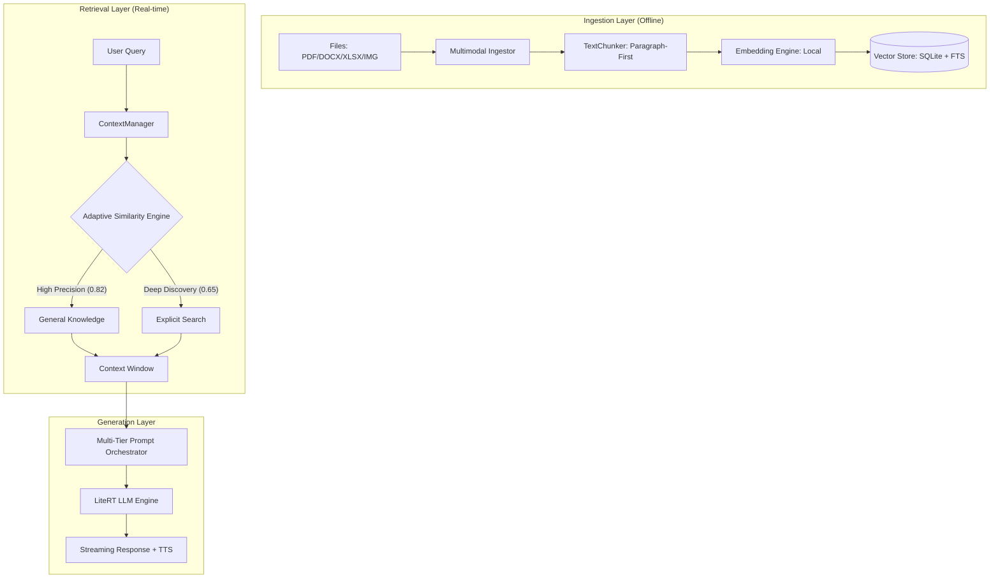
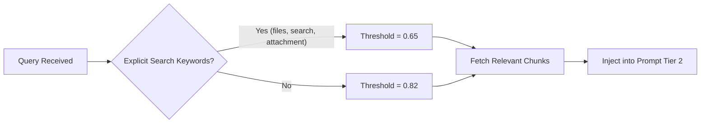
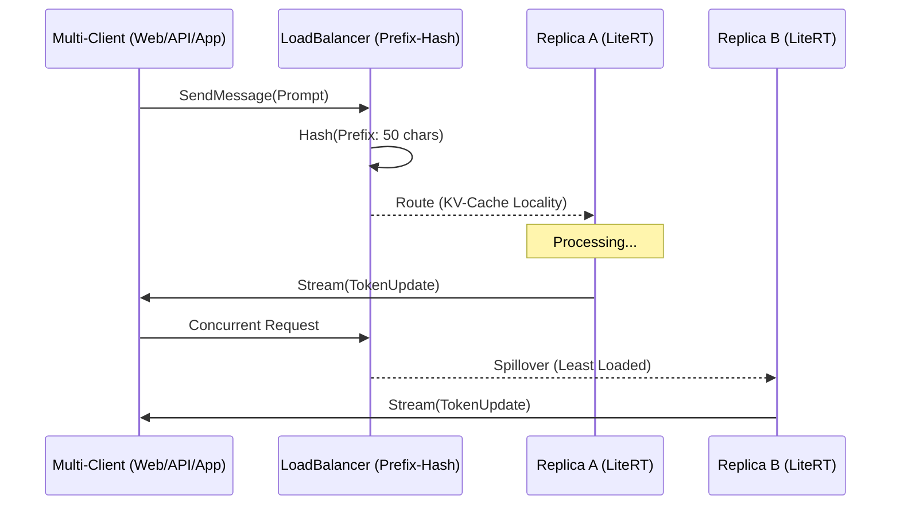

# ❓ Chhanda AI - Deep Dive & FAQ

## 🔒 Privacy & Security

### 1. Is Chhanda really 100% offline?
**Yes.** Once the app and models are downloaded, Chhanda requires zero internet for inference, RAG (document search), and chat. 
*   **Code Reference**: `LiteRTLMEngine.kt` handles model loading entirely via native JNI calls without any network stack.
*   **Exception**: The initial "Scraping" phase of a website URL requires internet to fetch the HTML content. Once fetched, the data is processed and stored locally.

### 2. How is my privacy protected during API interactions?
**Source-Based Ephemerality.**
*   **Local & Web (QR) Chat**: Stored in `chat_history` table for persistence.
*   **API Access**: Any request where `source == "api"` is processed without being saved to the database.
*   **Code Reference**: `SendMessageUseCase.kt` (Line 156) checks the `source` parameter to determine session persistence and persona.

---

## 🏗️ RAG Architecture & Techniques

### 3. How does the Chhanda RAG Pipeline work?
Chhanda implements a sophisticated, multi-stage RAG pipeline optimized for mobile edge computing.

### 4. What is "Adaptive Retrieval"?
Instead of a static similarity threshold, Chhanda uses a **Dual-Threshold Strategy** to balance between accuracy and thoroughness.
*   **Code Reference**: `ContextManager.kt` (Line 52) implements this logic.

### 5. How are prompts orchestrated in Chhanda?
Chhanda uses a **Multi-Tier Prompt System** to ensure the LLM prioritizes immediate context (attachments) over long-term indexed knowledge.
*   **Tier 1 (Immediate)**: Files currently attached to the chat session.
*   **Tier 2 (Global)**: Documents retrieved from the vector database.
*   **Tier 3 (Short-term)**: Recent chat history (last 10 turns).
*   **Code Reference**: `SendMessageUseCase.kt` (Lines 164-165) defines this hierarchy.

---

## 📈 Metrics & Observability

### 6. What is the significance of "Tail Latency" (p99)?
While average latency (p50) shows the typical speed, **p99** represents the slowest 1% of your queries. Tracking p99 is critical for identifying performance bottlenecks like thermal throttling or memory pressure.
*   **Code Reference**: `RAGMetricsManager.kt` (Lines 50-59).

### 7. Why track Recall@K and MRR for my documents?
*   **Recall@K**: Measures if the relevant information was found within the top 'K' results.
*   **MRR (Mean Reciprocal Rank)**: Measures how high the "perfect" answer appeared. Higher MRR means faster, more accurate context discovery.

---

## 🚀 Orchestration & Server Flow

### 8. How does the internal Load Balancer route requests?
Chhanda handles traffic from three distinct sources (Host UI, Web UI, API) using a prefix-hash load balancer to maximize performance.

---

## 📡 AI Server Architecture

### 9. What engine powers the Chhanda AI Server?
We use **Ktor** with the **CIO (Coroutine-based I/O)** engine.
*   **Optimization**: CIO is 100% Kotlin-native and avoids the Netty/JNI compatibility issues common on Android.
*   **Code Reference**: `ChhandaServer.kt` (Lines 45-53).

### 10. How does the "Public URL" (Tunneling) work?
Chhanda uses **JSch** to create an SSH tunnel via **localhost.run**. This provides zero-config remote access without port forwarding.
*   **Code Reference**: `ChhandaServer.kt` (Lines 284-293).

---

## 💬 Chat & Personas

### 11. Why does the AI sound like a "Senior Software Engineer" in my IDE?
Chhanda identifies the request source. Programmatic sources (API) trigger an expert technical persona for high-fidelity architectural guidance.
*   **Code Reference**: `SendMessageUseCase.kt` (Line 157).

### 12. Can I seek through the AI's voice responses?
**Yes.** The media engine includes a global playback bar with 10s forward/backward seeking and background playback support.

---

## 🛠️ Advanced Settings & Lifecycle

### 13. What is the "Reaper" service?
The **Active Reaper** is a background coroutine that monitors heartbeats from all connected web clients and purges inactive ones after 30 seconds.
*   **Code Reference**: `ChhandaServer.kt` (Lines 248-267).

### 14. Why does the server restart when I change the app language?
**Localization Safety Protocol.** Resets the server and inference cache to ensure all outputs (Web, API, TTS) reflect the new language choice correctly.

---

**Technical Troubleshooting**: For real-time diagnostics, check the **System Logs** in the Dashboard and search for `ChhandaAudit` tags in Logcat.
