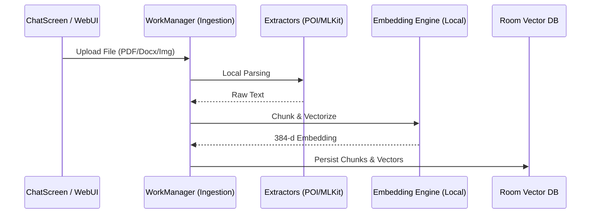
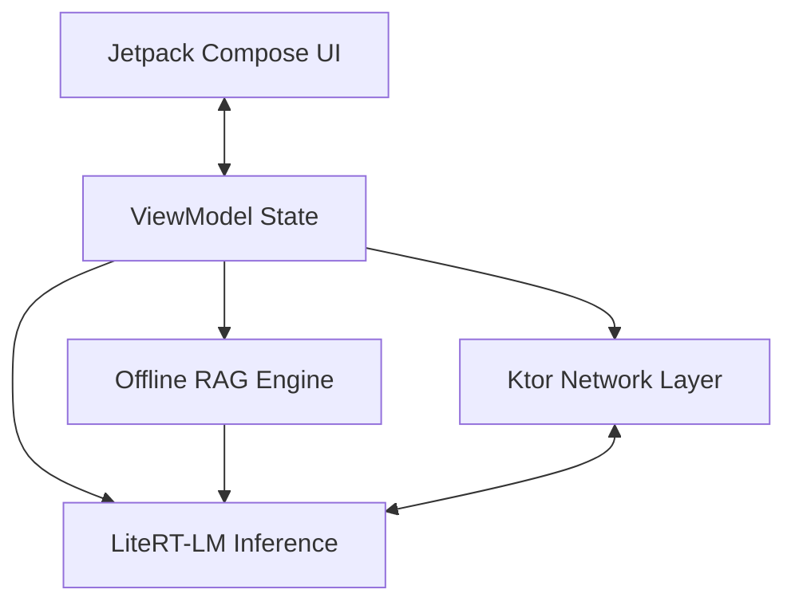

# Chhanda (ছন্দ) - The AI Gateway

**Harnessing Gemma 4 for 100% Offline, Privacy-First AI Accessibility**

---

## 📽️ Project Video
[Attached Public Video]
*(Replace this with your YouTube/Vimeo link)*

## 💻 Code Repository
[Attached Public Code Repository]
*(Replace this with your GitHub link: https://github.com/kallolchakraborty/Chhanda-AI)*

## 🚀 Live Demo / APK
[Attached Live Demo]
*(Replace this with a link to your hosted APK or a web-based simulator if available)*

---

## 💡 Motivation: The "Offline First" Vision

In many parts of the global south, specifically in rural India and Bangladesh, reliable high-speed internet is a luxury, not a guarantee. Furthermore, for non-English speakers, the "Digital Divide" is a double-edged sword: they lack both connectivity and accessible AI that understands their native rhythms.

**Chhanda (ছন্দ)**, named after the poetic meter in Bengali literature, was born from a simple yet powerful goal: **To put the power of a world-class LLM into the pocket of every user, regardless of their internet status or linguistic background.** 

I wanted to build a system where privacy is the default, not an option, and where intelligence flows as naturally as the *chhanda* of a poem, even in the most remote corners of the world.

## 🛠️ Solution Approach: Gemma 4 at the Edge

I leveraged **Google's Gemma 4 (2B & 4B 4-bit Quantized)** models to create a robust AI gateway on Android. ⚖️ **Built entirely as a solo developer**, this project involved architecting everything from the low-level JNI bindings to the responsive Web Gateway. Gemma 4 provides the perfect balance of parameter efficiency and reasoning capability required for high-performance edge computing. By utilizing **Google LiteRT-LM (formerly MediaPipe GenAI)**, I achieved hardware-accelerated inference that rivals cloud-based APIs while maintaining a zero-footprint architecture.

### Key Innovations:
*   **Chhanda Gateway**: A built-in Ktor-based server that turns the Android phone into a local AI hotspot. Other devices can connect via a QR code to access a high-fidelity Web UI, making one powerful phone an AI hub for an entire classroom or office.
*   **Adaptive Privacy-Native RAG**: A completely offline Retrieval-Augmented Generation pipeline using Apache POI and ML Kit. Featuring an **Adaptive Similarity Engine** that uses a precision-tuned threshold (0.82) to prevent hallucinations, while maintaining a deep-discovery mode (0.65) for user-provided attachments.
*   **Multimodal Office Ingestion**: Advanced support for PDF, Word (.doc, .docx), Excel (.xls, .xlsx), and Images (OCR). It indexes local knowledge without a single byte leaving the device.
*   **Premium Dynamic UI**: A sophisticated design system featuring **Context-Aware Iconography**. The app automatically detects and renders distinct icons and color-coded metadata for various document types, ensuring a professional and intuitive Knowledge Base experience.
*   **Intelligent Multi-Stage Web Scraper**: An advanced ingestion engine that uses a 3-stage strategy (Jsoup -> Jina Reader -> Semantic DOM) with integrated **Internet Connectivity Guard** to bypass bot protections and extract clean knowledge safely for local indexing.
*   **Production RAG Observability Dashboard**: A built-in monitoring suite that tracks **Tail Latency (p99)**, **QPS**, **Recall@K**, and **MRR** in real-time, bringing enterprise-grade monitoring to a local mobile application.
*   **Precision Native Resource Monitoring**: Implements **PSS (Proportional Set Size)** tracking to accurately report the total memory footprint (Java + Native) of the active LLM, alongside system-standard storage reporting.
*   **State-of-the-Art Media Playback**: A sophisticated TTS engine with a global seek-bar, background execution, and forward/backward controls, ensuring accessible AI communication.
*   **Offline Document Generation**: Empowering users to generate professional **.pdf**, **.docx**, and **.xlsx** files directly from AI responses, all while remaining 100% offline.
*   **Context-Aware Personalities**: An intelligent role-switching system that identifies the request source. When accessed via **API** (IDEs/Scripts), it acts as a **Senior Software Engineer** providing architectural guidance; for **Mobile/Web** chat, it acts as a helpful **Chhanda AI Assistant**.
*   **Localized TTS & UI**: Deep integration with Bengali and Hindi, featuring localized personalities and accents to make AI interaction feel familiar and inclusive.

## 🏗️ Development Process

1.  **Engine Selection**: I opted for GGUF formats optimized for LiteRT to ensure low-latency performance on mid-range Android hardware.
2.  **RAG Hardening**: Implemented an advanced **Selectivity Layer** that filters out "Small Talk" (greetings, thanks) from the RAG pipeline to prevent irrelevant document injection into common conversations.
3.  **UI/UX Refinement**: Developed a custom `RagFileItem` system in Jetpack Compose that uses semantic metadata to dynamically switch icons and colors, providing a premium feel to the "Memory" management screen.
4.  **Gateway Architecture**: Developed a responsive web dashboard served directly from the Android device, implementing strict API key security and IP-based captive portals.

## 🚧 Challenges & Triumphs

*   **Memory Management**: Running a 4B model alongside a Ktor server and a Vector Database on Android required aggressive memory hygiene. I solved this using scoped storage and lazy-loading Hilt components.
*   **Multi-Source Session Management**:
    *   Maintains unified chat history tagged by source: **Local** (Host device), **QR** (Web UI clients), and **API** (Programmatic access).
    *   **Security Policy**: For enhanced privacy, interactions via the **API source** (Code Editors) are ephemeral and are **not stored** in the local database.
    *   Includes sophisticated searching and sorting across all device histories.
*   **Multilingual Fidelity**: Ensuring the AI maintained its "personality" across English, Bengali, and Hindi required careful prompt engineering and localized system-level instructions.
*   **Document Generation**: Implementing offline generation of **.pdf**, **.docx**, and **.xlsx** files using Android's native PDF graphics and Apache POI. This was technically demanding due to library constraints and dependency conflicts, which I resolved through targeted ProGuard rules.

## 🌟 Social Impact: "Gemma 4 Good"

Chhanda is designed for:
*   **Education**: Students in low-connectivity areas can index their textbooks and ask questions in their native language.
*   **Privacy Advocacy**: Professionals can handle sensitive data (legal, medical) knowing the AI is physically disconnected from the cloud.
*   **Digital Equity**: By providing a "Gateway" mode, Chhanda allows one smart device to serve an entire group, drastically lowering the cost of AI access.
*   **Zero-Footprint API Security**: To protect professional workflows, any interactions initiated via the Chhanda API (e.g., from code editors or automated scripts) are processed strictly in-memory. No chat logs from API sources are persisted to the device's local database, ensuring a clean and secure development environment.

---

## 🖼️ Media Gallery

[Media Gallery]

### App Interface
*   **Dashboard**: Real-time telemetry monitoring TPS and hardware health.
*   **Web Gateway**: The QR-based connection interface for remote devices.
*   **Chat Experience**: Fluid, high-fidelity Markdown rendering in multiple languages.

### Technical Diagrams

#### 1. The Offline RAG Pipeline
How Chhanda processes and indexes knowledge without internet access.



#### 2. The Chhanda Gateway Flow
How the Android device acts as a secure local AI hub for other devices.

```mermaid
graph LR
    subgraph HostDevice [Android Host Device]
        LLM[Gemma 4 Engine]
        KTOR[Ktor Server]
        SM[Session Manager]
    end

#### 3. The Intelligent Scraper Flow
How Chhanda extracts clean knowledge from complex web environments.

```mermaid
graph TD
    URL[URL Input] --> JSOUP[Stage 1: Jsoup + JSON-LD]
    JSOUP -->|Confidence < 80%| JINA[Stage 2: Jina Reader Fallback]
    JINA -->|Failure| LR[Stage 3: Last Resort Body Extract]
    JSOUP -->|Success| CLEAN[Semantic Cleaner]
    JINA -->|Success| CLEAN
    LR --> CLEAN
    CLEAN --> VECTOR[Vector Ingestion Pipeline]
```
    
    subgraph RemoteClients [Remote Clients]
        Browser[Web Browser]
        API[External API]
    end
    
    Browser -- Scan QR --> KTOR
    API -- API Key --> KTOR
    KTOR --> SM
    SM --> LLM
    LLM -- Stream Response --> KTOR
    KTOR -- SSE / JSON --> Browser
```

#### 3. Unified Architecture
The high-level integration of the solo-developed ecosystem.



---

## 📜 License
This project is submitted under the **CC-BY 4.0** license.

Developed by **Kallol Chakraborty** (Solo Developer) using **Antigravity IDE** and **Gemini 3 Flash**.
Dedicated to **Chhanda Chakraborty**.
