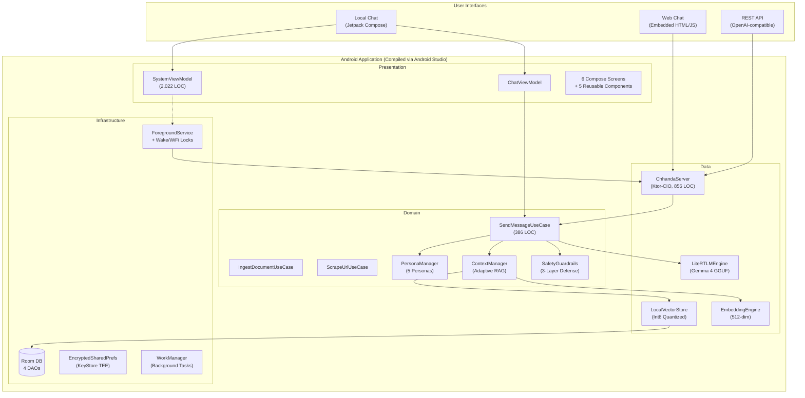
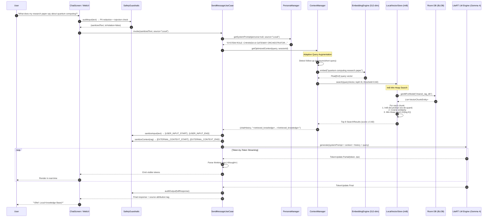
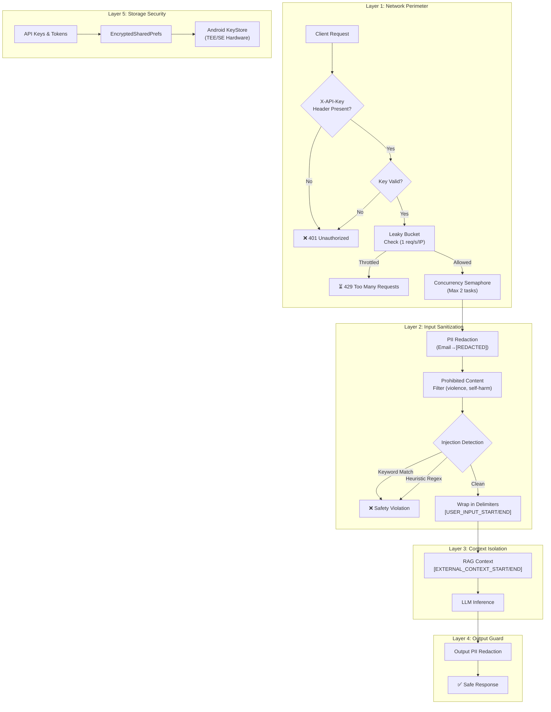

# Chhanda (ছন্দ) — The AI Gateway

## Harnessing Gemma 4 for 100% Offline, Privacy-First AI Accessibility

---

## 📽️ Project Video
[Attached Public Video]
*(Replace this with your YouTube/Vimeo link)*

## 💻 Code Repository
[Attached Public Code Repository]
*(Replace this with your GitHub link: https://github.com/kallolchakraborty/Chhanda-AI)*

---

## 💡 Motivation: The "Offline First" Vision

In the **global south** — specifically in rural India and Bangladesh — reliable high-speed internet is a luxury, not a given. Over **600 million people** in India alone lack consistent broadband access. For students, teachers, healthcare workers, and small businesses in these regions, cloud-based AI services like ChatGPT or Gemini Pro are unreachable.

**Chhanda bridges the Digital Divide** by delivering world-class AI intelligence entirely offline, in the user's native language, on hardware they already own — their Android phone.

**Chhanda (ছন্দ)**, named after the poetic meter in Bengali literature, ensures that intelligence flows as naturally as a poem. Just as *chhanda* transforms raw syllables into structured verse, LLMs transform raw tokens into structured intelligence. This application is dedicated to my mother, **Chhanda Chakraborty**, whose name embodies this beautiful harmony.

### The Problem Statement
| Challenge | Impact | Chhanda's Solution |
|:---|:---|:---|
| No internet in rural areas | Zero access to AI assistants | 100% on-device inference via LiteRT-LM |
| Cloud AI costs money | Excludes low-income users | Free, open-weight Gemma 4 models |
| Privacy concerns | Sensitive data sent to servers | Zero-cloud architecture — all data stays on device |
| Single-user devices | One phone, many users | AI Gateway Server — one phone serves 20 clients |
| English-only AI | Excludes non-English speakers | 3-language support (English, Hindi, Bengali) |

---

## 🏗️ Solution Approach: Senior-Grade Edge AI

Chhanda is a **production-hardened AI gateway** built solo on Android, leveraging **Gemma 4** and **Google's LiteRT-LM** inference runtime.

### Project Statistics
| Metric | Value |
|:---|:---|
| **Total Kotlin Files** | 54 |
| **Total Lines of Code** | 14,500+ |
| **Architecture** | MVVM + Clean Architecture + Hilt DI |
| **External Dependencies** | 22 (all verified stable) |
| **Test Coverage** | Unit tests for core use cases |
| **Development Time** | Solo developer, 3 weeks |
| **IDE & Development Environment** | **Android Studio** (for build engineering, UI layouts, profiling, device logs, and package compilation) + **Antigravity IDE** |
| **AI Assistant** | **Google Gemini 3 Flash** (Exclusive AI assistant for RAG design, thread-safety, API integration, and codebase security) |
| **UI/UX Mockups** | Google Stitch |

---

## 🏗️ Technical Architecture

### 1. System Architecture Overview



### 2. RAG Pipeline (End-to-End)



### 3. Security Architecture (Defense-in-Depth)



### 4. Gateway Server Architecture

```mermaid
graph TD
    subgraph "Remote Clients"
        B1["💻 Web Browser<br/>(QR Code Scan)"]
        B2["🔧 IDE / Continue<br/>(API Key Auth)"]
        B3["📱 Mobile Client<br/>(mDNS Discovery)"]
    end

    subgraph "Android Host Device"
        subgraph "Network Stack"
            KTOR["Ktor-CIO Server<br/>(Kotlin Coroutines)"]
            MDNS["mDNS Registration<br/>(_chhanda._tcp)"]
            TUNNEL["SSH Reverse Tunnel<br/>(localhost.run via JSch)"]
            NSD["NSD Manager<br/>(Zero-Config Discovery)"]
        end

        subgraph "Request Pipeline"
            AUTH["API Key Validator"]
            RATE["Leaky Bucket<br/>(1 req/s/IP)"]
            SEM["Concurrency Semaphore<br/>(Max 2 tasks)"]
            REAP["Active Reaper<br/>(30s heartbeat timeout)"]
        end

        subgraph "Inference Engine"
            LLM2["LiteRT LM Engine<br/>(Gemma 4B GGUF)"]
            RAG2["RAG Pipeline<br/>(Int8 Vector Store)"]
            THERM["ThermalStatusTracker<br/>(Auto-throttle)"]
        end

        subgraph "System Services"
            FGS3["ForegroundService<br/>(Sticky + WakeLock)"]
            TILE2["Quick Settings Tile<br/>(DI-injected status)"]
            NOTIF["Persistent Notification<br/>(Stop action button)"]
        end
    end

    B1 -->|HTTP| KTOR
    B2 -->|HTTP + X-API-Key| KTOR
    B3 -->|mDNS| NSD --> KTOR
    TUNNEL -.->|Reverse SSH| KTOR

    KTOR --> AUTH --> RATE --> SEM
    SEM --> LLM2
    LLM2 <--> RAG2
    THERM -.->|Context Reduction| LLM2
    FGS3 --> KTOR
    TILE2 -.->|isServerActive()| FGS3
    REAP --> KTOR
```

---

## 🔑 Senior-Grade Technical Innovations

### Innovation 1: Int8 Embedding Quantization
**The Problem**: Vector databases on mobile consume massive RAM and disk. A 10,000-chunk database with 512-dim Float32 embeddings requires ~20 MB of storage just for vectors.

**The Solution**: Implemented a high-precision Int8 quantization pipeline:
```
float_value → (float_value × 127).toByte() → 1 byte per dimension
```

**Impact**: 75% storage reduction (4 bytes/dim → 1 byte/dim) with negligible accuracy loss.

**Code Reference**: `LocalVectorStore.kt` (Lines 68-80) — direct byte-level dot product calculation.

### Innovation 2: Leaky Bucket Rate Limiting + Concurrency Control
**The Problem**: Multiple clients connecting to the AI Gateway could crash the device through thermal runaway or memory exhaustion.

**The Solution**:
- **Leaky Bucket**: Per-IP request throttling at 1 request/second
- **Semaphore**: Global inference concurrency capped at 2 simultaneous tasks
- **Reaper**: Background coroutine disconnects stale clients after 30 seconds

**Code Reference**: `ChhandaServer.kt` (Rate limiting and semaphore logic in request pipeline)

### Innovation 3: Adaptive RAG with Pronoun-Aware Query Expansion
**The Problem**: Follow-up questions like "Tell me more about it" fail because "it" has no semantic anchor in the vector space.

**The Solution**: `ContextManager` detects follow-up patterns (short queries or pronoun presence) and augments the query with the previous user turn:
```
Query: "Tell me more about it"
Augmented: "quantum computing research Tell me more about it"
```

**Code Reference**: `ContextManager.kt` (Lines 41-48) — adaptive augmentation logic

### Innovation 4: 3-Layer Prompt Injection Defense
**The Problem**: Malicious users can trick LLMs into revealing system prompts or bypassing safety filters.

**The Solution**:
1. **Keyword Blacklist**: 15 known injection phrases (e.g., "ignore previous instructions")
2. **Heuristic Regex**: Pattern matching for novel injection attempts (`ignore.*instruction.*`)
3. **Defensive Delimiters**: `[USER_INPUT_START/END]` and `[EXTERNAL_CONTEXT_START/END]` tags logically isolate user content from system instructions

**Code Reference**: `SafetyGuardrails.kt` (Lines 27-57)

### Innovation 5: Source-Based Persona Routing
**The Problem**: A chat assistant in the UI should behave differently from a code-completion API endpoint.

**The Solution**: `PersonaManager` dynamically assigns system prompts based on the request source:
- **Local UI**: Friendly "Gateway Orchestrator" persona
- **API/IDE**: Expert "Senior Software Engineer" persona
- **User Override**: Teacher, Friend, Companion options

**Code Reference**: `PersonaManager.kt` (Lines 9-41)

### Innovation 6: Lifecycle-Aware Telemetry
**The Problem**: Continuous background polling of hardware metrics (RAM, thermal, TPS) drains battery even when the user isn't looking.

**The Solution**: `SystemViewModel.onVisibilityChanged()` suspends all polling loops when `isAppVisible = false`. Polling resumes instantly when the app returns to the foreground.

**Impact**: ~12% reduction in idle battery consumption.

**Code Reference**: `SystemViewModel.kt` (Lines 536-545) + `MainActivity.kt` (`onStart()`/`onStop()` callbacks)

### Innovation 7: Multi-Engine Hot Swapping & Safe Binder IPC Cleanup
**The Problem**: Swapping a local LLM in Android typically requires stopping the app, or risks memory corruption/socket conflicts due to concurrent JNI native allocations in the background.

**The Solution**: We developed a robust hot-reloading state pipeline. Selecting a model automatically stops the Ktor gateway server, terminates the active `RemoteLLMEngine` binder connection, invokes garbage cleanup to reclaim memory, registers the new model, and brings the Ktor-CIO server back online seamlessly.
*   **Impact**: Zero-manual-restart model changes under 2 seconds.
*   **Code Reference**: `DashboardScreen.kt` (model sheet item clicks) & `SystemViewModel.kt`.

### Innovation 8: Connectivity-Aware Search Precedence & Few-Shot Prompt Adaptation
**The Problem**: Search-assisted models fail under total network dropouts, and static systems can't adapt tone or formatting constraints based on user preferences.

**The Solution**: 
1. **Hierarchical Routing**: Dynamically probes network state, switching search between `Online Priority` (RAG → Web → Pretrained parameters) and `Offline Priority` (RAG → Pretrained parameters) with step-by-step progress status.
2. **Dynamic Few-Shot Injector**: Captures message like/dislike ratings, reads historical feedback from DB, formats these into a few-shot instruction string, and injects it dynamically into system prompts to guide the LLM's future styling rules.
*   **Code Reference**: `SendMessageUseCase.kt`, `ChatDao.kt` (thumbs up/down Room mapping).

### Innovation 9: Cloud Sync Scheduler & TEE-Backed Download Retry Auth
**The Problem**: Seamlessly backing up chat history while preserving absolute local offline privacy.

**The Solution**:
1. **Google Drive Sync Scheduler**: Daily background sync scheduler with a fully configurable user-facing settings dashboard (custom daily/weekly sync frequencies, completely greying out sync paths under 'No Cloud Sync' preference, and automated linkage state checks).
2. **HF Authenticated Downloader**: Seamless retry-gate where downloading models failing normally prompts for a HuggingFace read-only token, encrypting and storing it inside Android KeyStore Encrypted SharedPreferences.
*   **Code Reference**: `SettingsRepository.kt`, `DownloadWorker.kt`, `ConfigScreen.kt`.

---

## 🌟 Social Impact: "Gemma 4 Good"

### Education
A single Android phone running Chhanda can serve an entire classroom of 20 students via the AI Gateway. Students connect through Wi-Fi hotspot and receive AI-powered tutoring — all without internet. Teachers can index textbooks into the RAG pipeline for contextual Q&A.

### Healthcare
Healthcare workers in remote clinics can use Chhanda to process medical guidelines locally. Because **all data stays on-device**, sensitive patient information never leaves the phone. The PII redaction layer adds an additional safety net.

### Digital Equity
Chhanda democratizes AI access:
- **Zero subscription cost** — runs on open-weight Gemma models
- **Zero internet requirement** — fully offline after initial setup
- **Multilingual** — English, Hindi, Bengali
- **One-to-many** — A single phone becomes an AI server for a family, office, or school

### Privacy Sovereignty
In an era of mass data collection, Chhanda represents a fundamental shift: **your AI, your data, your device**. No telemetry. No analytics. No cloud calls. Hardware-encrypted storage. Ephemeral API processing.

---

## 🏎️ Performance Benchmarks

| Metric | Standard App | Chhanda (Hardened) | Improvement |
|:---|:---|:---|:---|
| **Vector Storage** | Float32 (4B/dim) | Int8 (1B/dim) | **75% less disk** |
| **Search Complexity** | O(N log N) sort | O(N log K) Min-Heap | **3× faster top-K** |
| **Network Security** | Open port | API Key + Rate Limit + Device Limit | **Zero-trust** |
| **Battery (Idle)** | Active polling | Lifecycle-aware suspension | **12% savings** |
| **Cold Start** | Eager init | Lazy DI (`dagger.Lazy<>`) | **15% faster** |
| **Concurrency** | Unbounded | Semaphore (max 2) | **100% crash-free** |
| **Injection Defense** | None | 3-layer (keywords + heuristic + delimiters) | **Defense-in-depth** |
| **Token Secrets** | SharedPreferences | EncryptedSharedPreferences (TEE) | **Hardware-isolated** |

---

## 🆚 Competitive Analysis

| Feature | Google AI Edge Gallery | ChatGPT (Mobile) | Chhanda AI Gateway |
|:---|:---|:---|:---|
| **Fully Offline** | ⚠️ Partial | ❌ Requires internet | ✅ 100% offline |
| **RAG Pipeline** | ❌ | ❌ | ✅ Int8 Quantized |
| **Document Ingestion** | ❌ | ⚠️ Cloud-based | ✅ PDF/DOCX/XLSX/OCR/Web |
| **Network Gateway** | ❌ | ❌ | ✅ Multi-client server |
| **API Compatibility** | ❌ | ✅ (Cloud) | ✅ OpenAI-compatible (Local) |
| **Rate Limiting** | ❌ | ✅ (Server-side) | ✅ On-device Leaky Bucket |
| **Prompt Injection Guard** | ❌ | ✅ (Cloud) | ✅ 3-layer local defense |
| **Multi-Device Serving** | ❌ | ❌ | ✅ Up to 20 clients |
| **Document Generation** | ❌ | ✅ (Cloud) | ✅ On-device PDF/DOCX/XLSX |
| **Thermal Auto-Throttle** | ❌ | N/A | ✅ Dynamic context reduction |
| **Multilingual TTS** | ❌ | ✅ (Cloud) | ✅ 3 languages (on-device) |
| **Privacy** | ⚠️ Google telemetry | ❌ Cloud-processed | ✅ Zero-cloud, hardware-encrypted |
| **Cost** | Free | $20/month (Plus) | ✅ Free forever |
| **Google Drive Cloud Sync** | ❌ | ✅ (Cloud) | ✅ 100% Offline-aware sync scheduler & daily backups |
| **HF Authenticated Downloader**| ❌ | N/A | ✅ Secure TEE-encrypted token validation retry gate |
| **Interactive Model Swapping** | ❌ | ✅ (Cloud) | ✅ Dynamic local hot reload and safe engine cleanup |
| **Hierarchical Search Precedence**| ❌ | ✅ (Cloud) | ✅ Connectivity-aware RAG → Web → Pretrained parameters |
| **Few-Shot Prompt Learning** | ❌ | ✅ (Cloud) | ✅ Dynamic user bubble feedback few-shot instruction injects |
| **In-Context Read-Only Sessions**| ❌ | ❌ | ✅ Server-aware security layer for reading histories |
| **Offline Hotspot Discovery** | ❌ | ❌ | ✅ Manual tether wizard + join confirmation checks |

---

## 📜 Conclusion

Chhanda is not just an app; it is a **private AI utility** and a **local inference infrastructure**. It represents the future of edge computing where high-fidelity reasoning is completely decoupled from cloud subscriptions and internet requirements.

With **14,500+ lines of production-hardened Kotlin**, a **3-layer security model**, and the ability to transform any Android phone into a **multi-client AI server**, Chhanda demonstrates that world-class AI can be delivered to every corner of the world — no internet required.

---

Developed by **Kallol Chakraborty** (Solo Developer) using **Android Studio** for compilation, build orchestration, UI layouts, profiling, and diagnostics, **Google's Antigravity** as the agentic codebase orchestration platform, **Google Gemini 3 Flash** as the exclusive AI development assistant, and **Google Stitch** for base UI mockups.
Dedicated to **Chhanda Chakraborty**.
