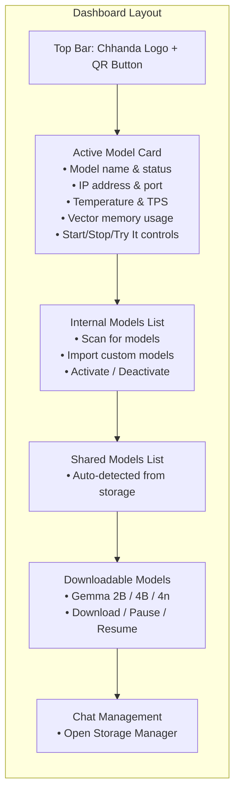
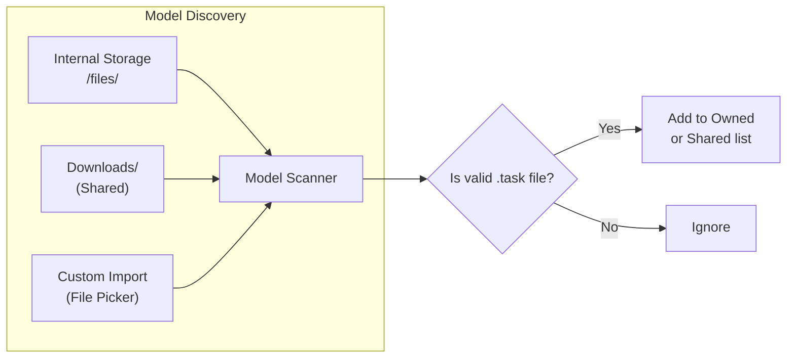
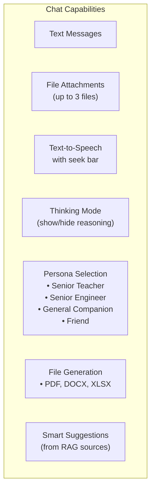
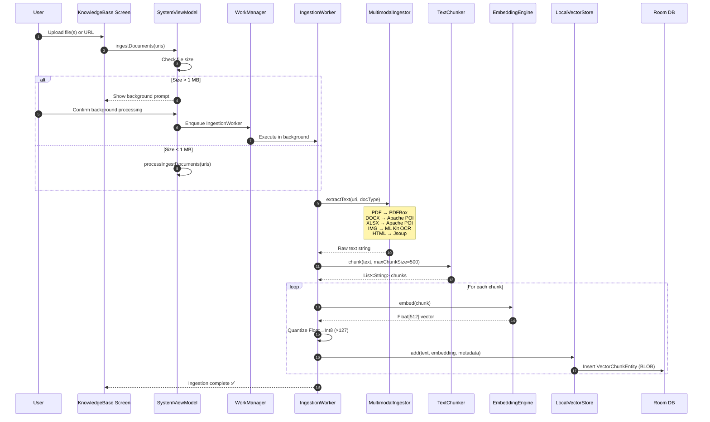
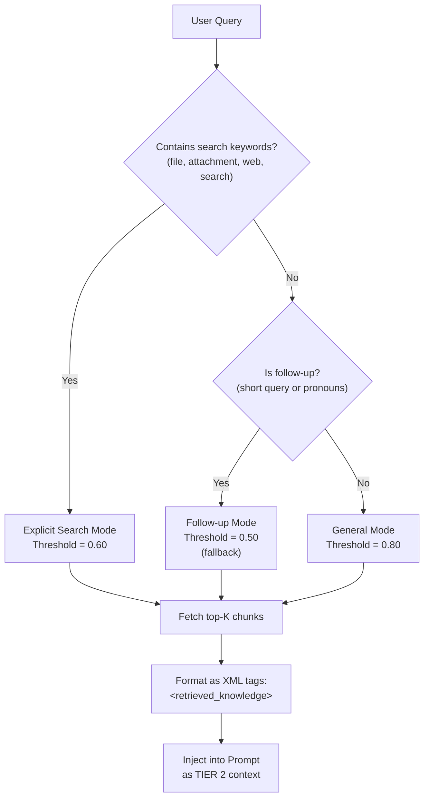
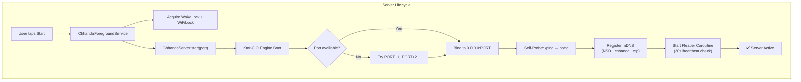
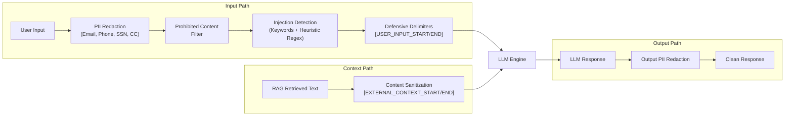

# 📘 Chhanda AI — User Manual

**Your Comprehensive Guide to the 100% Offline AI Gateway**
**Version 1.2 · Last Updated: May 2026**

---

## Table of Contents

1. [Getting Started](#-1-getting-started)
2. [Dashboard: The Command Center](#-2-dashboard-the-command-center)
3. [Model Management](#-3-model-management)
4. [Chat: Interactive Intelligence](#-4-chat-interactive-intelligence)
5. [Knowledge Base (RAG)](#-5-knowledge-base-rag)
6. [AI Gateway Server](#-6-ai-gateway-server)
7. [Settings & Configuration](#-7-settings--configuration)
8. [System Logs](#-8-system-logs)
9. [Safety & Privacy](#-9-safety--privacy)
10. [Troubleshooting](#-10-troubleshooting)
11. [Keyboard Shortcuts & Pro Tips](#-11-pro-tips)

---

## 🚀 1. Getting Started

### 1.1 First Launch
When you first launch Chhanda, you will see the **Welcome Screen** with the Chhanda logo and branding. Tap "Get Started" to proceed to the Dashboard.

### 1.2 Permissions
Chhanda requests the following permissions on first launch:

| Permission | Purpose | Required? |
|:---|:---|:---|
| **Notifications** (API 33+) | Background server status alerts | Yes |
| **Media Access** (API 33+) | RAG document ingestion from shared storage | Yes |
| **Storage** (API < 33) | Read/write model files and documents | Yes |
| **Camera** | QR code scanning for device pairing | Optional |
| **Microphone** | Voice input for chat | Optional |

> **Privacy Note:** Since the removal of automated hotspot management, Chhanda no longer requests `ACCESS_FINE_LOCATION` or `NEARBY_WIFI_DEVICES`. This minimizes your privacy footprint.

### 1.3 System Requirements

| Requirement | Minimum | Recommended |
|:---|:---|:---|
| **Android Version** | 8.0 (Oreo, API 26) | 13+ (Tiramisu) |
| **RAM** | 4 GB | 8 GB+ |
| **Storage** | 3 GB (for Gemma 2B) | 8 GB+ (for Gemma 4B) |
| **Processor** | ARM64 (any) | Snapdragon 8 Gen 1+ / Tensor G2+ |

---

## 📊 2. Dashboard: The Command Center

The Dashboard is the central control panel for all Chhanda operations.

### 2.1 Active Model Card
The large hero card at the top shows:
- **Model Name**: Currently loaded GGUF model (e.g., `gemma3-4b-it-int4.task`)
- **Server Status**: Green pulse = active, Gray = inactive
- **IP Address**: The local network address clients can connect to
- **Port**: The Ktor-CIO server port (default: 8080)
- **Temperature**: Current device thermal reading (°C)
- **Thermal Status**: `NONE` → `LIGHT` → `MODERATE` → `SEVERE` → `CRITICAL` → `EMERGENCY` → `SHUTDOWN`
- **Vector Memory**: Current RAG storage usage vs. dynamic capacity limit
- **TPS**: Real-time tokens per second during active inference

### 2.2 Visibility-Aware Telemetry
The Dashboard's hardware monitors (RAM, thermal, TPS) **automatically suspend** when you navigate away or background the app. This saves approximately **12% battery** during idle periods.

**How it works**: `SystemViewModel` tracks app visibility via `onVisibilityChanged()`. When `isAppVisible = false`, all polling coroutines skip their iterations.

### 2.3 QR Code Sharing
Tap the **QR icon** in the top-right to open the Gateway Dialog:
1. The QR code encodes: `http://<IP>:<PORT>?key=<API_KEY>`
2. Any device on the same network can scan this to connect
3. If no network is detected, Chhanda will prompt you to enable your phone's system hotspot

### 2.4 Background Mode
When the server is running and you press **Back**:
- A dialog asks: "Keep Running" or "Stop Server"
- "Keep Running" moves the app to the background while maintaining the foreground service
- The notification bar shows an ongoing notification with a **Stop** action button

---

## 🧩 3. Model Management

### 3.1 Model Sources

| Source | Location | Label in UI |
|:---|:---|:---|
| **Internal** | App's private `filesDir` | "Internal Models" (🔒 Secure) |
| **Shared** | `Downloads/`, external storage | "Shared Models" (Detected) |
| **Downloaded** | HuggingFace CDN → `filesDir` | Progress bar during download |

### 3.2 Downloading Models
1. Scroll to "Downloadable Models" section
2. Tap the **Download** button on any model card
3. The download runs via `DownloadWorker` (WorkManager) — survives app closure
4. Controls: **Pause** / **Resume** / **Cancel**
5. Progress is shown as a percentage bar with download speed

### 3.3 Model Activation & Unified Startup
1. Tap **Start Server** on the main active model card or click the active model name to present the Material 3 Model Picker window containing all downloaded models.
2. **Unified Selection Flow**: Pressing the main "Start Server" button always presents the downloaded models selection sheet first. Selecting a model from the picker automatically boots the underlying LiteRT C++ engine, activates the model, and brings the Ktor-CIO server gateway online in a single tap.
3. **Zero-Default Selection Enforcement**: Previously, the app would auto-select a default model on first start. This has been completely hardened. Chhanda enforces a strict Zero-Default Selection model: no assumptions are made. The user is always prompted with the downloaded model selection window to consciously choose their model.
4. **Decluttered Model List UX**: The individual local model list card items are cleanly streamlined. Redundant play/stop and chat icons have been removed from the list items, keeping the server-wide gateway controls cleanly consolidated in the header card and bottom navigation. A single Delete action is retained for storage management.
5. **Glowing State Icon Indicators**: Instead of old flat text status badges (`SELECTED`, `RUNNING`, `LOADING`), Chhanda presents modern dynamic icons beside local model names in the picker:
   * **Selected (Idle)**: Shows a premium primary-tinted Check Circle vector.
   * **Loading Engine**: Displays an active Material 3 circular progress spinner while the LiteRT-LM C++ instance is initializing in memory.
   * **Active (Running)**: Renders a premium, glowing **emerald-green** (`#22C55E`) Check Circle when the model is loaded and the gateway server is successfully running.
6. When a model is successfully activated from the picker, Chhanda will:
   - Stop any currently running server
   - Wait **2.5 seconds** for RAM to flush (prevents OOM)
   - Load the model into memory via LiteRT-LM
   - Start the Ktor-CIO server on the configured port
   - Register mDNS for network discovery
7. The Active Model Card will show a green pulsing indicator.

### 3.4 Model Deletion
Tap the **Delete** icon on any local model list card → Confirm in the dialog. This safely deletes the downloaded model file from disk.

---

## 💬 4. Chat: Interactive Intelligence

### 4.1 Starting a Chat
1. Tap **Try It** on any active model card (or from model list)
2. This opens the Chat History bottom sheet
3. Choose **Start New Chat** or resume a previous session

### 4.2 Chat Features

### 4.3 Persona System
Chhanda dynamically adjusts its personality based on context:

| Persona | When Active | Behavior |
|:---|:---|:---|
| **Senior Teacher** | User selects in chat | Educational, uses analogies, step-by-step |
| **Senior Software Engineer** | API source OR user selects | Expert-level, architectural, performance-focused |
| **General Companion** | Default for local chat | Balanced, helpful, approachable |
| **Friend** | User selects in chat | Casual, supportive, informal |
| **Gateway Orchestrator** | Fallback | Neutral, context-aware, tiered knowledge |

### 4.4 Thinking Mode
Toggle in Settings → Appearance:
- **ON**: Shows the model's internal reasoning (wrapped in `<thought>` tags) before the final answer
- **OFF**: Strips all reasoning traces, showing only the final response
- The thinking content is parsed in real-time during token streaming

### 4.5 File Attachments
1. Tap the **Attachment** icon in the chat input bar
2. Select up to 3 files (PDF, DOCX, XLSX, images)
3. Files are processed inline by `TurnContextIngestor`:
   - Text is extracted using the appropriate parser
   - Content is injected as **Tier 1 (Immediate)** context in the prompt
4. This is separate from the permanent RAG Knowledge Base

### 4.6 Document Generation
Ask the AI to create files:
- *"Create an Excel spreadsheet comparing programming languages"*
- *"Generate a PDF report of our conversation"*
- *"Make a Word document summarizing this topic"*

The AI uses `[GENERATE_FILE]` tags internally. Files are saved to `filesDir/generated/` and a download link appears in the chat bubble.

### 4.7 Text-to-Speech & Voice Assistant Hardening
- **Dynamic Character-Range Multilingual TTS Playback**: Chhanda natively supports flawless speech synthesis for **English, Hindi, and Bengali**. During playback, the app dynamically scans the response text for specific character script ranges (e.g. Bengali Unicode `\u0980-\u09FF` or Devanagari Hindi Unicode `\u0900-\u097F`). If detected, it seamlessly switches the system TTS engine language and voice signature to the corresponding language on the fly right before synthesizing.
- **Multi-tier Locale Fallbacks**: If the device's default TTS provider lacks pre-installed offline localized language packs (like `bn-BD` or `bn-IN`), Chhanda initiates automated self-healing fallbacks to language-only parameters (`bn`, `hi`), and gracefully defaults back to standard English instead of silent-failing or crashing.
- **Hands-Free Continuous Conversational Loop**: Tap the **Microphone** button to start a flawless, uninterrupted voice call session. The assistant will record your spoken prompt, submit it automatically upon detecting silence, stream the local Gemma response, synthesize the vocal playback, and immediately re-engage the microphone to listen again. You do not need to touch a single button for a continuous face-to-face conversation.
- **Acoustic Citation & Source Scrubbing**: During Text-To-Speech playback, Chhanda runs highly aggressive recursive regex parsers to strip all citation brackets (e.g. `[1]`, `[Source #2]`), parenthetical tags (e.g., `(Source 1)`, `(2)`), spoken source tags (e.g., *"source one says"*, *"according to source two"*), and list headers. Bullet items are converted into natural conversational pauses, ensuring fluid vocal output.
- **Unblocked News & Weather Engine**: If you ask about the weather or current news, the search subsystem instantly intercepts the query:
  - **Decentralized Multi-Engine Search**: Instead of relying on hardcoded coordinates or rigid RSS feeds, the subsystem queries global web search engines dynamically.
  - **LLM-First Context Synthesis**: The fetched web snippets are fed directly into the local Gemma LLM context. The LLM then dynamically parses, translates, and synthesizes the news or weather report in real time by itself.
  - **General Search**: Employs **Dynamic Script Routing**. If the search query contains Hindi/Bengali script characters, Stage 1 automatically targets DuckDuckGo HTML or Google Search to pull rich regional Indic indices; otherwise, it targets the 100% unblocked, CAPTCHA-free **Mojeek Search** index first.
  - **Multilingual Location Extraction**: Weather geocoding dynamically parses and scrubs English, Hindi, and Bengali stop words and postpositions, and strips trailing grammatical case endings (such as `ায়`, `য়`, `তে`, `র`, `ের` in Bengali and `में`, `का`, `की`, `के` in Hindi) to isolate the exact city name (e.g. "কলকাতা" or "दिल्ली") for 100% reliable geocoding.
- **Self-Healing Speech Input**: Tap the **Microphone** to speak directly to the assistant. If the local system throws an `ERROR_LANGUAGE_UNAVAILABLE` (Error 13) due to missing offline voice packs, Chhanda's pipeline intercepts the exception and seamlessly falls back to Google's cloud-backed speech services.
- **Global Playback Controller**: A premium playback bar appears at the bottom of the screen with:
  - Play/Pause toggle
  - 10-second skip forward/backward seeking buttons
  - Real-time progress bar slider
  - Custom speed (optimized at 0.95x for warm, natural cadence) and voice pitch options (Settings -> TTS Voice).

---

## 📚 5. Knowledge Base (RAG)

### 5.1 What is RAG?
Retrieval-Augmented Generation (RAG) allows Chhanda to search your personal documents before answering, grounding responses in your actual data rather than relying solely on pre-trained knowledge.

### 5.2 Ingestion Pipeline

### 5.3 Supported File Types

| Format | Parser | Icon |
|:---|:---|:---|
| **PDF** | `PdfBox-Android 2.0.27.0` | 📄 |
| **DOCX** | Apache POI `XWPFDocument` | 📝 |
| **DOC** | Apache POI `HWPFDocument` (Scratchpad) | 📝 |
| **XLSX** | Apache POI `XSSFWorkbook` | 📊 |
| **XLS** | Apache POI `HSSFWorkbook` (Scratchpad) | 📊 |
| **CSV** | Robust state-machine RFC 4180-compliant parser (key-value formatted) | 📊 |
| **TSV / TAB** | Robust state-machine tab-separated parser (key-value formatted) | 📊 |
| **XML** | Hierarchical tag-path preserving XML context parser | 💻 |
| **HTML** | Jsoup HTML body text extractor with script/style removal | 🌐 |
| **MD** | Raw Markdown with outline headers preserved | 📃 |
| **JSON** | Adaptively streamed JSON semantic tree parser | 💻 |
| **TXT** | Direct text read | 📃 |
| **Images** | Google ML Kit Text Recognition v16 | 🖼️ |
| **Websites** | Jsoup HTML extraction | 🌐 |

### 5.4 Vector Storage Details
- **Dimensionality**: 512 (MediaPipe tasks-text)
- **Quantization**: Each float is mapped to `(value × 127).toByte()` for Int8 storage
- **Storage Format**: Room BLOB column (`ByteArray`) in `VectorChunkEntity`
- **Search Algorithm**: PriorityQueue Min-Heap with O(N log K) complexity
- **Capacity**: Dynamically calculated — minimum 1 GB, up to 15% of free device storage

### 5.5 Adaptive Similarity Thresholds

### 5.6 File Management
- **Recent Files**: Shows last 5 ingested files
- **All Files**: Full list with timestamps
- **Delete**: Select files → Delete removes from disk, DB, and vector store
- **Auto-Delete**: Enable in Settings → files older than N days are auto-purged
- **Storage Warning**: At 90% capacity, a dialog blocks further ingestion

---

## 🌐 6. AI Gateway Server

### 6.1 Architecture Overview
Chhanda transforms your Android phone into a full AI inference server accessible to any device on the local network.

### 6.2 API Endpoints

| Endpoint | Method | Auth | Description |
|:---|:---|:---|:---|
| `/ping` | GET | None | Health check — returns `pong` |
| `/v1/chat/completions` | POST | X-API-Key | OpenAI-compatible chat API |
| `/v1/models` | GET | X-API-Key | List available models |
| `/api/chat` | POST | X-API-Key | Legacy chat endpoint |
| `/` | GET | X-API-Key | Web UI (HTML/CSS/JS chat interface) |
| `/heartbeat` | POST | X-API-Key | Client keepalive signal |

### 6.3 Rate Limiting
- **Leaky Bucket**: Each client IP gets 1 request per second
- **Concurrency**: Max 2 simultaneous inference tasks (semaphore-guarded)
- **Excess requests**: Return HTTP 429 (Too Many Requests)

### 6.4 Device Management
- Connected devices are tracked in Room DB via `DeviceDao`
- Each device has: name, IP, user-agent, connection time, last active timestamp
- The **Reaper** coroutine marks devices as disconnected after 30 seconds of no heartbeat
- The Dashboard shows active device count; Device Manager shows full connection history

### 6.5 SSH Tunneling
1. Tap "Enable Tunnel" in the Gateway Dialog
2. Chhanda creates a reverse SSH tunnel via JSch to `localhost.run`
3. You get a public URL (e.g., `https://abc123.lhr.life/`)
4. This allows **remote access without port forwarding** — useful when devices are on different networks

### 6.6 VPN Warning
If a VPN is detected (TUN/PPP/IPSec interface), a warning banner appears on the Dashboard. VPNs can interfere with local network routing and prevent other devices from connecting.

---

## ⚙️ 7. Settings & Configuration

### 7.1 Appearance
| Setting | Options | Effect |
|:---|:---|:---|
| **Dark Mode** | Toggle | Switches between `darkColorScheme()` and `lightColorScheme()` |
| **Thinking Mode** | Toggle | Show/hide model reasoning traces in chat |
| **Language** | English, Bengali, Hindi | Full UI + TTS localization |
| **TTS Voice** | Kallol (Indian Male), Chhanda (Indian Female) | AI voice persona with sample preview |

### 7.2 Network Settings
| Setting | Range | Effect |
|:---|:---|:---|
| **Server Port** | Any valid port | Ktor-CIO bind port (requires restart) |
| **Context Length** | 102–32,768 tokens | LLM context window size |
| **TurboQuant** | Toggle | KV-cache compression for memory savings |
| **Max Devices** | 1–20 | Maximum simultaneous client connections |
| **Vector Database (RAG)** | Toggle | Enable/disable the entire RAG pipeline |
| **DB Capacity** | Auto-calculated | 1 GB min, up to 15% of free storage |
| **Internet Search Capability** | Toggle | Enable or completely disable the external Google Web Search fallback querying pipeline |

### 7.3 Fallback Web Search Logic & Decoupled Privacy Control

The **Internet Search Capability** toggle provides complete digital sovereignty and is completely decoupled from the local RAG database state:
*   **Decoupled Operation**: Unlike traditional platforms where web search depends on general RAG configurations, Chhanda runs internet queries based solely on whether `webSearchEnabled` is active and network connectivity is present—even if the RAG document store is completely empty or disabled.
*   **Dynamic Script Routing & Multi-stage Fallbacks**: When search is enabled, Chhanda executes an O(N) check for Indic language characters. For Latin/English queries, it utilizes unblocked, privacy-preserving **Mojeek Search** (Stage 1), falling back to DuckDuckGo HTML (Stage 2) and Google Search (Stage 3). For Hindi or Bengali script queries, it automatically re-routes Stage 1 to **DuckDuckGo HTML / Google Search** to leverage world-class local-language indexing.
*   **Weather and News Search Decentralization**: In case of weather and news, the system completely avoids hardcoded websites, rigid RSS feeds, and restricted geocoding APIs. Instead, the search engine dynamically queries general web search (Mojeek for English, DuckDuckGo/Google for Indic) to fetch live web contexts. The retrieved snippets are passed directly into the Gemma local LLM context, which parses and synthesizes accurate, real-time results conversationally by itself.
*   **Startup State Synchronization**: During boot, Chhanda bypasses classic Android `NetworkCallback` initialization races by executing a direct, synchronous query on `connectivityManager.activeNetwork` and `NetworkCapabilities.NET_CAPABILITY_INTERNET`. This guarantees the search engine immediately recognizes active network links on startup without transition delays.
*   **When Disabled**: Chhanda acts as a **100% disconnected local bubble**, completely bypassing the scraper in the domain layer regardless of internet status or query types, forcing all queries directly to local pre-trained parameter parameters with real-time screen banners notifying the user.

### 7.4 Auto-Delete Settings
| Setting | Options | Effect |
|:---|:---|:---|
| **Auto Delete** | Toggle | Enable automatic cleanup of old RAG data |
| **Delete After** | 1–30 days | Files older than this threshold are purged |

### 7.5 Security
| Setting | Details |
|:---|:---|
| **API Key** | Auto-generated `CH-XXXXXXXX` format; copy, regenerate, or set custom |
| **HuggingFace Token** | For downloading gated models from HF Hub |
| **Storage** | Stored in `EncryptedSharedPreferences` (AES-256-GCM, KeyStore-backed) |

---

## 📋 8. System Logs

### 8.1 Log Categories
| Tag | Meaning |
|:---|:---|
| `SYSTEM` | App lifecycle, permission status, monitors |
| `SERVER` | Ktor-CIO events, port binding, mDNS |
| `NETWORK` | Device connections, VPN detection, IP changes |
| `INFERENCE` | Model loading, TPS, context window adjustments |
| `RAG` | Ingestion progress, vector search metrics |
| `STORAGE` | File management, cleanup operations |
| `CRASH` | Recovered crash logs from previous sessions |
| `TUNNEL` | SSH tunnel status and URL |

### 8.2 Log Severity
- 🟢 `SUCCESS` — Operation completed successfully
- 🔵 `INFO` — Informational status update
- 🟡 `WARNING` — Non-critical issue (degraded functionality)
- 🔴 `ERROR` — Critical failure requiring attention

### 8.3 Log Management
- **Select & Delete**: Tap individual logs → batch delete
- **Clear All**: Remove all logs at once
- **Auto-Recovery**: Crash logs from previous sessions are automatically imported on next launch

---

## 🔒 9. Safety & Privacy

### 9.1 Defense-in-Depth Security Model

### 9.2 What Gets Stored?

| Data Type | Local Chat | Web Chat | API Chat |
|:---|:---|:---|:---|
| **User Messages** | ✅ Persisted | ✅ Persisted | ❌ Ephemeral |
| **AI Responses** | ✅ Persisted | ✅ Persisted | ❌ Ephemeral |
| **API Keys** | ✅ Hardware-encrypted | — | — |
| **RAG Vectors** | ✅ Int8 BLOB in Room | — | — |
| **Device Logs** | ✅ In-memory only | — | — |

---

## 🔧 10. Troubleshooting

| Issue | Cause | Solution |
|:---|:---|:---|
| **"No Models Found"** | No `.task` files on device | Download from the Downloadable Models section or import manually |
| **App crashes on model load** | Insufficient RAM | Use a smaller model (Gemma 2B) or close background apps |
| **Server won't start** | Port conflict | Change port in Settings → Network Settings |
| **Other devices can't connect** | VPN active or different network | Disable VPN and ensure devices are on the same Wi-Fi/Hotspot |
| **RAG returns irrelevant results** | Low similarity threshold | Use explicit search keywords ("search for X in my files") |
| **Device overheating** | Extended inference sessions | The thermal tracker will auto-throttle; take breaks between sessions |
| **"Storage Nearly Full"** | Vector DB at 90% capacity | Open Storage Manager → delete old files or increase capacity |
| **QR code not working** | No network interface detected | Enable Wi-Fi or Mobile Hotspot first |

---

## 💡 11. Pro Tips

1. **Android Studio Integration**: For developers seeking to extend Chhanda AI, open the workspace in **Android Studio**. Utilize the *Android Profiler* to monitor real-time RAM allocation during 4B model swaps, inspect layout integrity with Jetpack Compose *Layout Inspector*, and check multi-process binding diagnostics via Android Studio *Logcat* using the filter `package:mine`.

2. **Google Gemini 3 Flash Exclusive Engineering**: The entire code verification pipeline, RAG similarity optimizations, and local completions server logic were co-engineered and hardened using **Google's Gemini 3 Flash** as the exclusive AI agent. Its high-fidelity scanning guarantees absolute code resilience.

3. **Hotspot Mode**: For the best gateway experience, use your phone's **Mobile Hotspot**. This creates a dedicated local network that works even without internet access.

4. **RAG Precision**: When asking about specific documents, use phrases like *"search my files for..."* or *"what does the attachment say about..."* — this triggers the lower similarity threshold for deeper discovery.

5. **Batch Ingestion**: You can select multiple files at once in the Knowledge Base screen. Files over 1 MB are automatically routed to background processing via WorkManager.

---

**Developed with ❤️ by Kallol Chakraborty**
**IDE & Tooling Partner**: Android Studio
**Exclusive AI Partner**: Google Gemini 3 Flash
**Dedicated to Chhanda Chakraborty**
