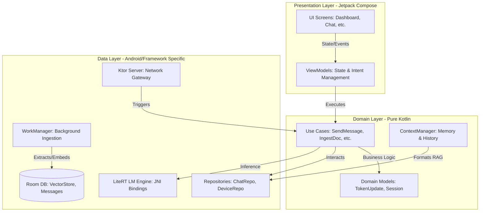
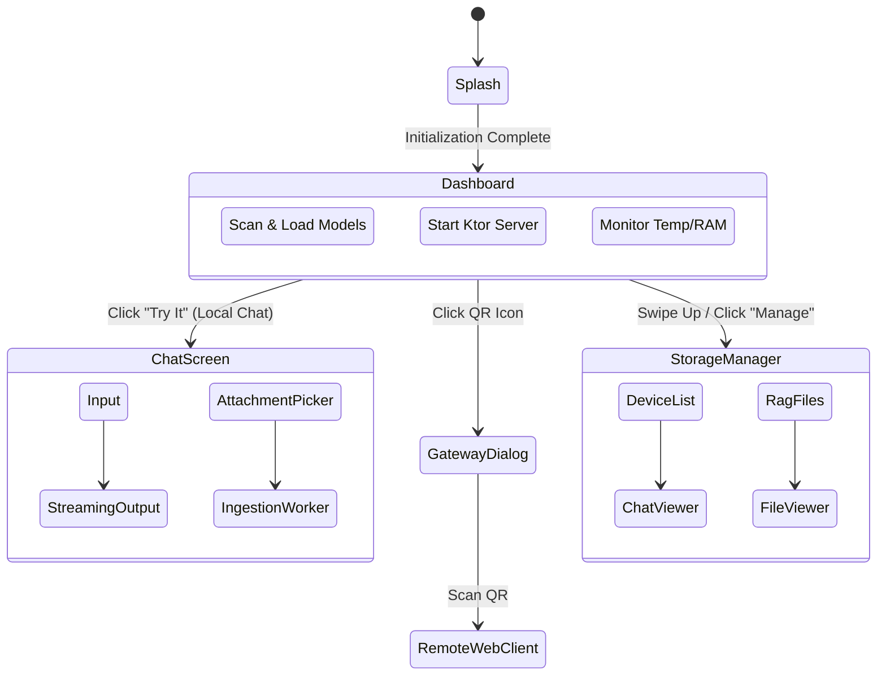
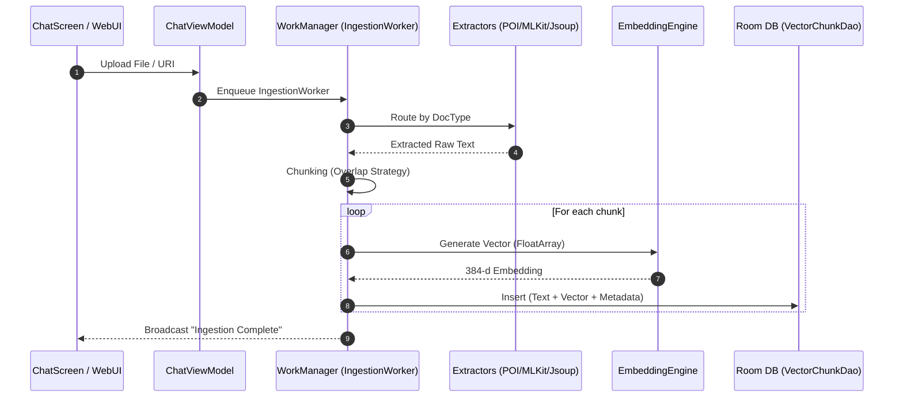
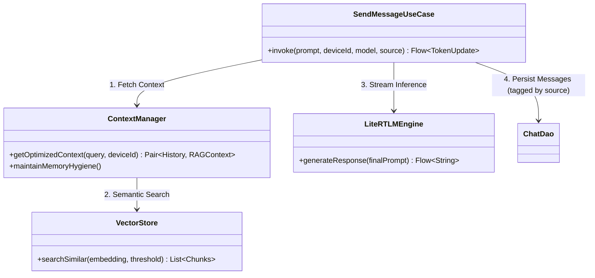
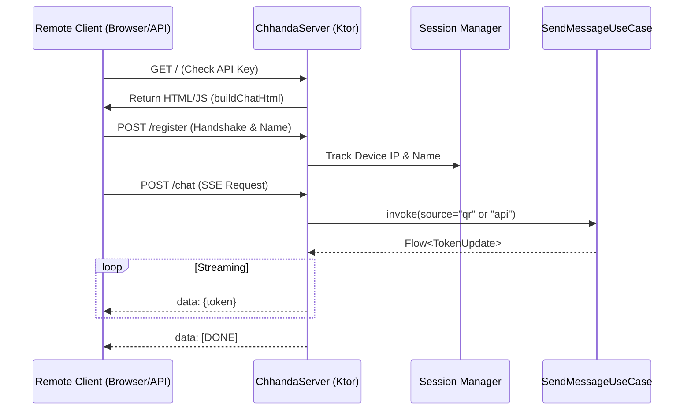

# Chhanda (ছন্দ) - The AI Gateway

  <h3>100% Offline, Privacy-First AI & RAG Ecosystem for Android</h3>
  
<i>Developed by <b>Kallol Chakraborty</b> | Dedicated to my mother, Chhanda.</i>

---

## 📖 The Philosophy & Dedication

**Chhanda** (ছন্দ) refers to the poetic meter or rhythm in Bengali literature. It structures poetry through the precise arrangement of syllables (*mātrā*), derived from words, creating a musical, rhythmic flow. 

In Bengali poetry, words are broken down into syllables—the basic sound units treated as tokens—for chhanda analysis. Each word’s pronunciation determines *guru* (long) or *laghu* (short) syllables, and stress patterns form the rules of the meter.

**The Connection to AI:**
Just as *Chhanda* structures raw syllables into beautiful, flowing poetry, Large Language Models (LLMs) break down human language into structural **tokens**. By predicting and arranging these tokens based on complex mathematical weights (the meter of the neural network), the AI generates coherent, intelligent, and flowing communication. 

This application is named after and dedicated to my mother, Chhanda, representing the harmony between the foundational structure of language and the beautiful flow of intelligence.

---

## 🛠 Development & Tooling

This project is a testament to modern AI-assisted software engineering:
*   **Developer**: Kallol Chakraborty
*   **IDE**: Antigravity
*   **AI Development Partner**: Gemini 3 Flash
*   **UI/UX Mockups**: Google Stitch
*   **Branding & Logos**: Nanobana

---

## 🚀 Extreme Detail: App Features

Chhanda is not just a chat app; it is a full-fledged local AI server and gateway.

1.  **Zero-Cloud Local Inference**: Utilizes Gemma 2B and 4B (4-bit quantized GGUF) models running entirely on-device via Google LiteRT-LM. No data is ever sent to the cloud.
2.  **Adaptive Multimodal RAG (Retrieval-Augmented Generation)**:
    *   **Documents**: Advanced local parsing for `.pdf`, `.docx`, `.doc`, `.xlsx`, `.xls`, and `.txt` using Apache POI.
    *   **Adaptive Similarity Engine**: Implements a dual-threshold strategy (0.82 for high-precision KB search, 0.65 for deep attachment discovery) to prevent hallucinations while maintaining thoroughness.
    *   **Selectivity Layer**: Intelligent "Small Talk" filtering that prevents irrelevant knowledge base injection into general greetings and common conversation.
    *   **Vision**: Extracts text from images using Google ML Kit OCR.
    *   **Web**: Advanced multi-stage scraping engine (Jsoup/Jina) that extracts semantic content and structured JSON-LD metadata from any website.
    *   **Audio**: Speech-to-text integration for indexing spoken content.
3.  **Premium Document Interface**:
    *   **Context-Aware Iconography**: A sophisticated UI system that dynamically renders unique icons and color-coded metadata for various document types.
    *   **Unified Formatting**: Integrated metadata display (`[Source: filename] [Type: format]`) across the Knowledge Base and Chat interfaces.
4.  **Offline Document Generation**: The AI can generate `.xlsx`, `.docx`, and `.pdf` files locally on demand, which users can download via the host app or the Web UI.
5.  **Chhanda AI Gateway (Web UI via QR)**: 
    *   Turns the Android device into a local network server via Ktor.
    *   Other devices on the same Wi-Fi/Hotspot can scan a QR code to access a beautiful, responsive Web Chat UI.
    *   Features strict Device Limits, Captive Portals for unauthorized access, and API Key authentication.
6.  **Multi-Source Session Management**:
    *   Maintains unified chat history tagged by source: **Local** (Host device), **QR** (Web UI clients), and **API** (Programmatic access).
    *   **Security Policy**: For enhanced privacy, interactions via the **API source** (Code Editors) are ephemeral and are **not stored** in the local database.
    *   Includes sophisticated searching and sorting across all device histories.
7.  **Telemetry & Hardware Monitoring**: Real-time tracking of TPS (Tokens Per Second), RT (Response Time), RAM usage, and Battery Temperature.
8.  **Context-Aware Personalities**: 
    *   **Expert Mode (API)**: When accessed via the API (e.g., from an IDE), Chhanda adopts the persona of a **Senior Software Engineer**, providing optimized, technical, and architectural guidance.
    *   **Assistant Mode (Local/Web)**: For on-device or QR-based chat, it acts as a **General Purpose Assistant**, optimized for helpful, clear, and multi-lingual communication.

---

## 🏗 High-Level Architecture (Clean Architecture)

Chhanda strictly follows Android Clean Architecture principles, ensuring separation of concerns, testability, and scalability.

---

## 🧱 Technology Stack & Libraries

### Core Frameworks
*   **Language**: Kotlin (Coroutines & StateFlow for reactive asynchronous programming).
*   **UI Framework**: Jetpack Compose (Material 3).

### AI & Machine Learning
*   **LLM Inference**: `com.google.ai.edge.litert` (LiteRT / MediaPipe GenAI) for hardware-accelerated local GGUF execution.
*   **Vision**: `com.google.mlkit:text-recognition` for on-device OCR.
*   **Embeddings**: Local sentence-transformer execution via MediaPipe tasks.

### Data & Persistence
*   **Database**: Room (`androidx.room`) with SQLite. Implements custom vector similarity search for RAG.
*   **DataStore**: Preferences DataStore for local settings (API keys, limits).

### Networking & Web Server
*   **Server**: Ktor Server (`ktor-server-netty`, `ktor-server-cors`) for the embedded Web UI and API.
*   **Web Scraping**: Jsoup for robust HTML parsing and Readability scoring.

### Document Processing
*   **Apache POI**: `poi-ooxml` for reading and generating Microsoft Word and Excel documents completely offline.
*   **PDF**: Android's native `PdfRenderer` and custom PDF generators.

### Dependency Injection & Background Work
*   **DI**: Hilt (`dagger.hilt.android`).
*   **Background Tasks**: WorkManager (`androidx.work`) for heavy document ingestion and scraping tasks to prevent ANRs.

---

## 📱 Screen-Wise Functionality & Flows

### 1. Dashboard Screen (The Command Center)
**Functionality**: 
*   Displays hardware telemetry (RAM, Temp, IP Address).
*   Manages local GGUF models (scan, activate, delete).
*   Controls the Ktor Server (Start/Stop, QR Code generation).
*   Access point for the History/Storage Manager.

### 2. Chat Screen (The Interface)
**Functionality**:
*   Primary interface for interacting with the loaded LLM.
*   Supports attaching images and documents.
*   Real-time streaming UI with Markdown rendering, syntax highlighting, and TPS/RT metric overlays.
*   Handles inline rendering of AI-generated downloadable files.

### 3. History Manager (StorageManagerSheet)
**Functionality**:
*   Unified view of all chats across all connected devices (Local, Web, API).
*   Features deep-search across message contents and multi-criteria sorting.
*   Manages ingested RAG files (view, delete, purge).

### Screen Flow Diagram

---

## ⚙️ Low-Level Design (LLD) Diagrams

### RAG & Document Ingestion Pipeline LLD
When a user uploads a document (Word, Excel, PDF) or an Image, the system processes it asynchronously.

### Chat Orchestration LLD (`SendMessageUseCase`)
This is the core brain that combines Chat History, RAG Context, and LLM Inference.

### Web Gateway & Server LLD (`ChhandaServer`)
Handles multiple remote clients via the Android host.

---

## 🔒 Security & Privacy Posture
*   **Data Sovereignty**: 100% of embeddings, models, and chat histories reside within the Android App Sandbox. 
*   **Network Protection**: The Ktor server enforces API key validation for all endpoints. Unauthorized IP addresses attempting discovery are met with a Captive Portal intercept.
*   **Safe Execution**: The inference engine implements strict threading controls and mutex locks to prevent C++ level memory corruption during rapid multi-client access.

---

## 🌍 Localization & Universal Accessibility
 
Chhanda is built for global utility with a deep focus on the Indian subcontinent:
*   **Multi-Language UI**: Full localization in **English**, **Bengali** (বাংলা), and **Hindi** (हिन्दी).
*   **App-wide Translation**: All system messages, instructions, and error codes are translated to ensure non-technical users can operate the gateway.
*   **Cross-Language RAG**: The system can ingest documents in any language and provide semantic search results in the user's preferred language.
*   **Localized TTS (Text-to-Speech)**: Features human-like voices for each supported language. 
    *   **Bengali & Hindi Support**: Optimized for Indian accents and clear pronunciation.
    *   **Virtual Personalities**: Choice between different voice profiles (e.g., Kallol, Adrit, Chhanda, Ivanshika) that map to the highest quality system voices available on the device.
*   **Language Safety Gate**: Switching app languages triggers a safety protocol that shuts down active server instances and cleans the inference cache to ensure all components (including the Web Gateway) restart with the correct locale.
 
---
 
## 📜 Conclusion
Chhanda represents a harmony of complex AI systems, working together in a specific, optimized rhythm—much like its namesake. It bridges the gap between high-end cloud AI capabilities and the absolute privacy of edge computing.
