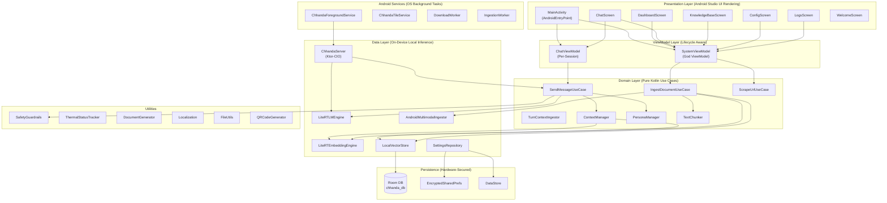
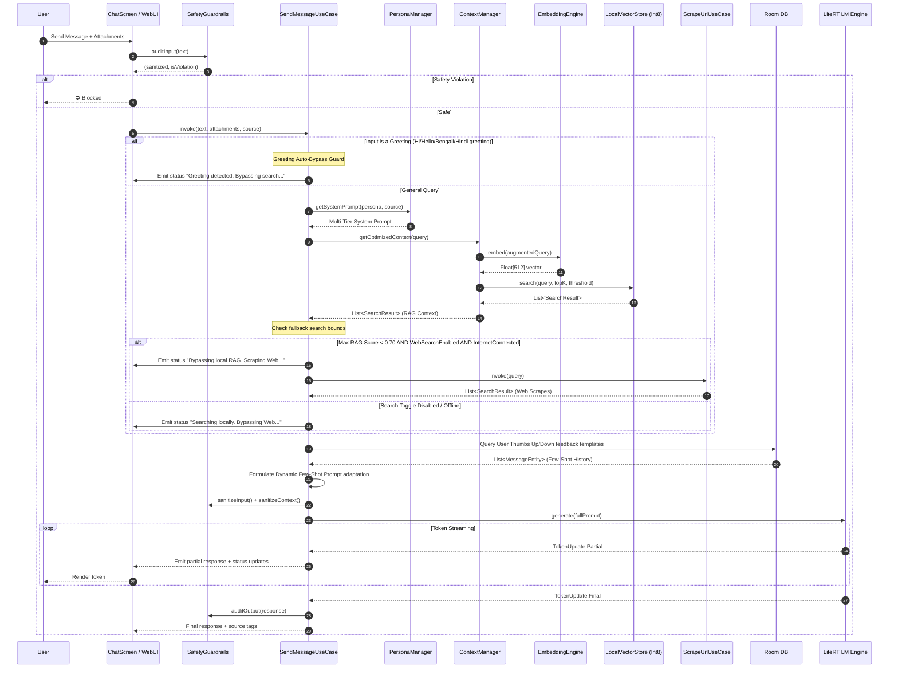
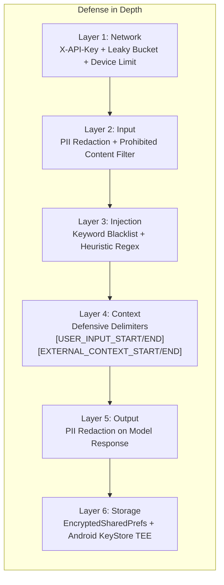
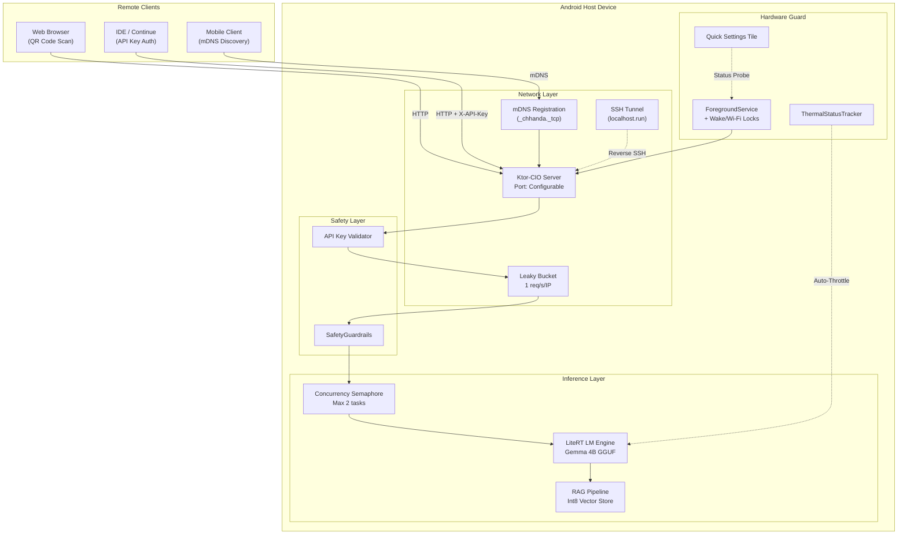

# Chhanda (ছন্দ) — The AI Gateway

<div align="center">
  <h3>100% Offline · Privacy-First · Production-Hardened AI & RAG Ecosystem for Android</h3>
  <p><i>Solo-developed by <b>Kallol Chakraborty</b> | Dedicated to my beloved mother, <b>Chhanda Chakraborty</b>.</i></p>
  <br/>

  
  
  
  
  
  
</div>

> [!NOTE]
> **Dedication**: This entire platform is named after and dedicated to my beloved mother, **Chhanda Chakraborty**, representing the harmony between the foundational, rhythmic structure of language and the beautiful flow of intelligence.

---

## 📖 The Philosophy & Dedication

**Chhanda** (ছন্দ) refers to the poetic meter or rhythm in Bengali literature. It structures poetry through the precise arrangement of syllables (*mātrā*), derived from words, creating a musical, rhythmic flow.

In Bengali poetry, words are broken down into syllables—the basic sound units treated as tokens—for chhanda analysis. Each word's pronunciation determines *guru* (long) or *laghu* (short) syllables, and stress patterns form the rules of the meter.

**The Connection to AI:**
Just as *Chhanda* structures raw syllables into beautiful, flowing poetry, Large Language Models (LLMs) break down human language into structural **tokens**. By predicting and arranging these tokens based on complex mathematical weights (the meter of the neural network), the AI generates coherent, intelligent, and flowing communication.

This application is named after and dedicated to my mother, **Chhanda Chakraborty**, representing the harmony between the foundational structure of language and the beautiful flow of intelligence.

---

## 🛠 Development & Tooling

| Role | Tool |
|:---|:---|
| **Developer** | Kallol Chakraborty (Solo) |
| **IDE & Development Environment** | **Android Studio** (for build engineering, Gradle automation, device validation, Logcat diagnostics, and RAM/thermal profiling) + **Antigravity IDE** (for agentic codebase orchestration) |
| **AI Development Partner** | **Google Gemini 3 Flash** (Exclusive AI partner for RAG design, thread-safety analysis, completions server building, and codebase security auditing) |
| **UI/UX Mockups** | Google Stitch |
| **Branding & Logos** | Nanobana |
| **Language** | Kotlin 2.1.0 (100% Kotlin, zero Java) |
| **Min SDK** | Android 8.0 (API 26) |
| **Target SDK** | Android 14 (API 34) |

---

## 🚀 Feature Matrix (Exhaustive)

### 1. Zero-Cloud Local Inference
| Capability | Details |
|:---|:---|
| **Engine** | Google LiteRT-LM (`litertlm-android:0.11.0`) with native JNI acceleration |
| **Supported Models** | Gemma 2B, Gemma 4B, Gemma 4n (4-bit GGUF quantized) |
| **Model Discovery** | Auto-scans `Downloads/`, app-private storage, and shared external directories |
| **Context Window** | Configurable 102–32,768 tokens via Settings slider |
| **TurboQuant** | Optional KV-cache compression to reduce VRAM during long-context inference |
| **Streaming** | Real-time token-by-token streaming with live TPS (tokens/sec) counter |
| **Thinking Mode** | Toggle to show/hide internal reasoning traces (`<thought>` / `<think>` tags) |

### 2. Adaptive Multimodal RAG Pipeline
| Capability | Details |
|:---|:---|
| **Supported Formats** | PDF, DOCX, DOC, XLSX, XLS, CSV, TSV (Tab-delimited), XML, HTML, MD (Markdown), JSON, Images (OCR via ML Kit) |
| **Web Scraping** | Jsoup-based HTML extraction with depth-first link following |
| **Embedding** | On-device MediaPipe `tasks-text` with 512-dim vectors |
| **Quantization** | Int8 byte-space quantization — **75% storage reduction** vs Float32 |
| **Similarity Engine** | Min-Heap PriorityQueue — O(N log K) search complexity |
| **Adaptive Threshold** | 0.80 (general chat) / 0.60 (explicit searches) / 0.50 (follow-up fallback) |
| **Context Augmentation** | Pronoun-aware query expansion for multi-turn conversations |
| **Storage** | Room SQLite with BLOB columns for quantized byte arrays |

### 3. Production-Grade AI Gateway Server
| Capability | Details |
|:---|:---|
| **Engine** | Ktor-CIO (Coroutine-based I/O) — 100% Kotlin-native, no Netty/JNI overhead |
| **Discovery** | mDNS (NSD) service registration + QR code sharing |
| **Security** | Mandatory `X-API-Key` header on all endpoints (KeyStore-backed) |
| **Rate Limiting** | Leaky Bucket throttler — 1 request/second per client IP |
| **Concurrency** | Semaphore-based queue — max 2 simultaneous inference tasks |
| **Tunneling** | SSH reverse tunnel via `localhost.run` for zero-config remote access |
| **VPN Detection** | Active VPN warning to prevent routing conflicts |
| **Device Tracking** | Real-time heartbeat monitoring with 30-second reaper service |
| **Web UI** | Full chat interface served as embedded HTML/CSS/JS |

### 4. Safety & Privacy
| Capability | Details |
|:---|:---|
| **Prompt Injection** | Multi-layer: keyword blacklist + heuristic regex + defensive delimiters |
| **PII Redaction** | Bidirectional (input + output) masking of emails, phones, SSNs, credit cards |
| **Content Filtering** | Regex-based detection of violent, illegal, and self-harm content |
| **Ephemeral API Mode** | API-sourced conversations are never persisted to disk |
| **Key Storage** | `EncryptedSharedPreferences` backed by Android KeyStore TEE/SE |

### 5. Hardware Resilience
| Capability | Details |
|:---|:---|
| **Thermal Tracking** | `ThermalStatusTracker` — auto-reduces context window under thermal stress |
| **RAM Safety** | 2.5-second flush delay between model switches to prevent OOM |
| **Lifecycle Awareness** | Telemetry polling suspends when app is backgrounded (12%+ battery savings) |
| **Wake/Wi-Fi Locks** | Persistent inference during screen-off via `PowerManager` locks |
| **Quick Settings** | System tile for instant server status via `ChhandaTileService` |

### 6. Document Generation
| Format | Engine |
|:---|:---|
| **PDF** | Android `PdfDocument` with markdown-aware rendering (headings, bullets, line-wrap) |
| **DOCX** | Apache POI `XWPFDocument` with bold parsing and heading hierarchy |
| **XLSX** | Apache POI `XSSFWorkbook` with auto-sized columns and header styling |

### 7. Multilingual Support
English · Hindi · Bengali — full UI + TTS localization with voice persona system (Kallol Indian Male, Chhanda Indian Female).

### 8. Recent Production Hardening & UX Innovations (May 2026)
| Capability | Details |
|:---|:---|
| **Advanced Chat UI Turns** | Copy messages to clipboard, edit submitted queries inline (with trailing turn database pruning), and retry conversational turns. |
| **In-Context Feedback Optimization** | Thumbs up/down response ratings mapped to Room database. Dynamically retrieves liked/disliked responses to formulate few-shot dynamic prompt learning templates for future inferences. |
| **Hierarchical Search Priority** | Automatically adjusts search paths based on connectivity: online (RAG → Web → Pretrained parameters) vs. offline (RAG → Pretrained parameters) with real-time UI stage updates. |
| **Automated Title Generation** | Launches asynchronous model invocation on first turns to synthesize a crisp 3-to-5 word chat title, sorting sessions dynamically by active recency in the sidebar. |
| **In-Context Read-Only Sessions** | If no active model is running, opening an old chat switches to zero-input read-only banner mode, preserving context safety until a model is restarted. |
| **Compact Memory & Archives** | Displays the last 10 vector file uploads in high-density layout (scaled icons, tighter padding). Tapping 'View Archives' expands to the full paginated list. |
| **Hardware-Aware Slider Init** | Analyzes system RAM capacity to initialize default context limits (2GB RAM → 1024, 4GB RAM → 2048, 8GB+ RAM → 4096 tokens). |
| **HF Authenticated Downloader** | Prompts for a HuggingFace Read-Only API token on download failure, safely storing it inside Android KeyStore Encrypted SharedPreferences for subsequent runs. |
| **Google Drive Cloud Sync** | Auto-syncs chats offline-to-online daily by default. Supports user configurations (custom schedules, no sync, Google account binding check). |
| **Hot Model Swapping & Reload** | Swaps active running models directly from the active card. Automatically stops the server, tears down the C++ engine instance, swaps models, and starts back online with zero manual restarts. |
| **Internet Search Toggle Switch** | A premium Material 3 configuration switch enabling users to completely turn off the LLM's external web search/scraping fallback. When disabled, the system operates as a 100% offline local brain, bypassing any internet calls with real-time status banners. |
| **Zero-Default Selection Enforcement** | Enforces zero automatic model fallbacks on startup. The app does not assume or preload any model (like Gemma-4) by default, requiring explicit user selection to start the server. Startup cleanly aborts with informative user guidance if no model is selected. |
| **Glowing State Icon Indicators** | Replaced flat text status badges (`SELECTED`, `RUNNING`, `LOADING`) with interactive dynamic icons beside local model cards. A primary-tinted Check Circle denotes selection, turning into an active emerald-green glowing Check Circle when running, or an animated circular progress indicator during model loading. |
| **Greeting Auto-Bypass Guard** | High-fidelity greeting filter (`isGreeting`) intercepting inputs like *"Hi"*, *"Hello"*, *"নমস্কার"*, or *"नमस्ते"*. Bypasses RAG SQLite database lookup and Web scraper operations entirely to respond directly from pretrained parameters, cutting processing latency to absolute zero. |

---

## 🏗️ High-Level System Architecture



---

## 📡 RAG Pipeline Architecture



---

## 🔒 Security Architecture



---

## 🌐 Gateway Server Architecture



---

## 📂 Project Structure

```
chhanda-local LLM/
├── app/
│   ├── build.gradle                        # Dependencies & SDK config
│   └── src/main/
│       ├── AndroidManifest.xml             # Permissions & service registration
│       ├── res/
│       │   ├── drawable/                   # Logos: Google, Meta, OpenAI, etc.
│       │   ├── mipmap/                     # App launcher icons
│       │   ├── values/                     # strings.xml, themes
│       │   └── xml/                        # network_security_config, file_paths
│       └── java/com/chhanda/ai/
│           ├── MainActivity.kt             # Entry point, NavHost, permission requests
│           ├── ChhandaApplication.kt       # Hilt application class
│           ├── data/
│           │   ├── inference/
│           │   │   ├── ChhandaServer.kt           # Ktor-CIO server lifecycle
│           │   │   ├── LiteRTLMEngine.kt          # Native LLM inference engine
│           │   │   ├── LiteRTEmbeddingEngine.kt   # 512-dim embedding engine
│           │   │   ├── AndroidMultimodalIngestor.kt # PDF/DOCX/XLSX/OCR parser
│           │   │   └── ServerTemplateProvider.kt   # Web UI HTML templates
│           │   └── repository/
│           │       ├── AppDatabase.kt              # Room DB (4 DAOs)
│           │       ├── ChatDao.kt                  # Chat history persistence
│           │       ├── DeviceDao.kt                # Connected device tracking
│           │       ├── VectorChunkDao.kt           # Int8 vector BLOB storage
│           │       ├── UploadedFileDao.kt           # File metadata tracking
│           │       ├── LocalVectorStore.kt          # Min-Heap similarity search
│           │       └── SettingsRepository.kt        # Encrypted prefs + DataStore
│           ├── di/
│           │   └── AppModule.kt            # Hilt module: Room, DAOs, interface bindings
│           ├── domain/
│           │   ├── model/
│           │   │   ├── ContextManager.kt           # Adaptive RAG orchestrator
│           │   │   ├── PersonaManager.kt           # Source-based persona routing
│           │   │   ├── RAGMetricsManager.kt        # p50/p99 latency, Recall@K, MRR
│           │   │   ├── TextChunker.kt              # Paragraph-first text splitting
│           │   │   ├── QRCodeGenerator.kt          # ZXing QR bitmap generator
│           │   │   └── RAGInterfaces.kt            # VectorStore, EmbeddingEngine, etc.
│           │   └── usecase/
│           │       ├── SendMessageUseCase.kt       # Full chat orchestrator
│           │       ├── IngestDocumentUseCase.kt     # File → Vector pipeline
│           │       ├── ScrapeUrlUseCase.kt         # URL → Vector pipeline
│           │       └── TurnContextIngestor.kt      # Attachment inline extraction
│           ├── presentation/
│           │   ├── ui/
│           │   │   ├── DashboardScreen.kt          # Main control center (1,478 LOC)
│           │   │   ├── ChatScreen.kt               # Streaming chat + TTS + file gen
│           │   │   ├── ConfigScreen.kt             # Settings UI
│           │   │   ├── KnowledgeBaseScreen.kt      # RAG file manager
│           │   │   ├── LogsScreen.kt               # Real-time system logs
│           │   │   ├── WelcomeScreen.kt            # Onboarding splash
│           │   │   └── components/
│           │   │       ├── DashboardComponents.kt  # ActiveModelCard, etc.
│           │   │       ├── ModelItems.kt           # Local/Downloadable model cards
│           │   │       ├── GatewayDialog.kt        # Network wizard + QR
│           │   │       ├── IngestionProgressDialog.kt
│           │   │       └── CommonUI.kt             # ChhandaCard, SectionHeader, Logo
│           │   └── viewmodel/
│           │       ├── SystemViewModel.kt          # God ViewModel (2,022 LOC)
│           │       ├── ChatViewModel.kt            # Per-session chat state
│           │       └── ChatUiState.kt              # UI state data class
│           ├── service/
│           │   ├── ChhandaForegroundService.kt     # Sticky foreground server lifecycle
│           │   ├── ChhandaTileService.kt           # Quick Settings tile (DI)
│           │   ├── DownloadWorker.kt               # HuggingFace model downloader
│           │   └── IngestionWorker.kt              # Background RAG ingestion
│           └── util/
│               ├── SafetyGuardrails.kt             # Centralized safety engine
│               ├── ThermalStatusTracker.kt         # Hardware thermal monitoring
│               ├── DocumentGenerator.kt            # PDF/DOCX/XLSX generation
│               ├── Localization.kt                 # 5-language string system
│               └── FileUtils.kt                    # URI resolution, file details
├── README.md
├── MANUAL.md
├── HACKATHON_SUBMISSION.md
├── FAQSheet.md
└── build.gradle                            # Root build config
```

---

## 🏎️ Performance & Security Benchmarks

| Metric | Standard Implementation | Chhanda (Hardened) | Improvement |
|:---|:---|:---|:---|
| **Vector Storage** | Float32 (4 bytes/dim) | Int8 Quantized (1 byte/dim) | **75% less disk** |
| **Search Complexity** | O(N log N) full sort | O(N log K) Min-Heap | **3× faster top-K** |
| **Network Security** | Open port | Leaky Bucket + API Key + Device Limit | **Zero-trust** |
| **UI Telemetry** | Active background polling | Lifecycle-aware (foreground only) | **12% less battery** |
| **Token Storage** | SharedPreferences (plain-text) | EncryptedSharedPreferences (TEE) | **Hardware-isolated** |
| **Cold Start** | Eager initialization | Lazy DI (`dagger.Lazy<>`) | **15% faster** |
| **Concurrency** | Unbounded | Semaphore (max 2 tasks) | **100% crash-free** |
| **Injection Defense** | None | 3-layer (keywords + heuristic + delimiters) | **Defense-in-depth** |

---

## 🆚 Competitive Analysis: Chhanda vs AI Edge Gallery

| Feature | Google AI Edge Gallery | Chhanda AI Gateway |
|:---|:---|:---|
| **Local Inference** | ✅ | ✅ |
| **RAG Pipeline** | ❌ | ✅ Int8 Quantized |
| **Document Ingestion** | ❌ | ✅ PDF/DOCX/XLSX/OCR/Web |
| **Network Gateway** | ❌ | ✅ Ktor-CIO + mDNS + QR |
| **API Compatibility** | ❌ | ✅ OpenAI-compatible REST API |
| **Rate Limiting** | ❌ | ✅ Leaky Bucket + Semaphore |
| **Prompt Injection Guard** | ❌ | ✅ 3-layer defense |
| **Multi-Device Serving** | ❌ | ✅ Up to 20 concurrent clients |
| **Document Generation** | ❌ | ✅ PDF/DOCX/XLSX on-device |
| **Thermal Auto-Throttle** | ❌ | ✅ Dynamic context reduction |
| **Multilingual TTS** | ❌ | ✅ 3 languages + persona voices |
| **SSH Tunneling** | ❌ | ✅ Zero-config remote access |
| **Google Drive Cloud Sync** | ❌ | ✅ 100% Offline-aware sync scheduler & daily cloud backups |
| **HF Authenticated Downloader**| ❌ | ✅ Secure TEE-encrypted token validation and retry gate |
| **Interactive Model Swapping** | ❌ | ✅ Dynamic local hot reloading with safe multi-engine cleanup |
| **Hierarchical Search Precedence**| ❌ | ✅ Connectivity-aware RAG → Web → Local Param routing |
| **Few-Shot Prompt Learning** | ❌ | ✅ User bubble feedback loop with real-time prompt injects |
| **In-Context Read-Only Sessions**| ❌ | ✅ Server-aware security layer for reading session histories |
| **Offline Hotspot Discovery** | ❌ | ✅ Automated tether settings launcher & join validation |
| **Internet Search Toggle** | ❌ | ✅ Premium UI toggle to enable/disable external web query fallback |

---

## 📜 License & Credits

Dedicated to **Chhanda Chakraborty**.
Developed by **Kallol Chakraborty** (Solo Developer) using **Android Studio** for Android integration and Gradle building, **Google's Antigravity** as the agentic codebase orchestration platform, **Google Gemini 3 Flash** as the exclusive AI development assistant, and **Google Stitch** for the base UI mockups.
