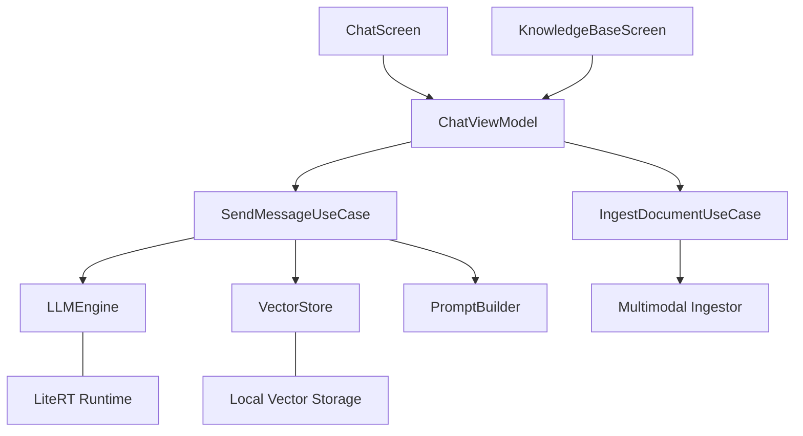
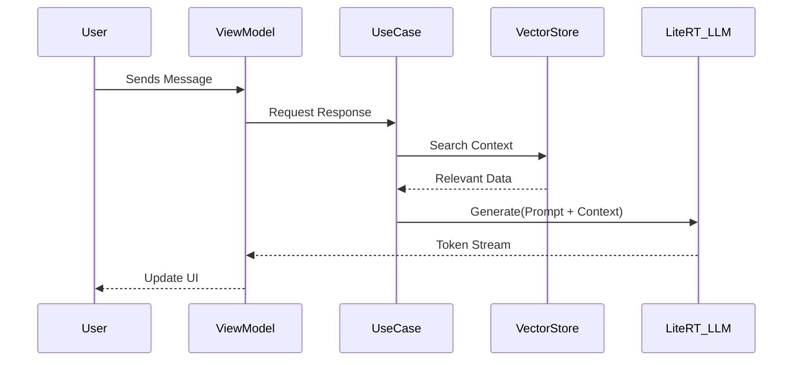

# Chhanda: Production-Grade On-Device AI with RAG

Chhanda is a 100% offline, privacy-first AI application designed for high-performance Retrieval-Augmented Generation (RAG) on Android. It utilizes **Gemma 2B (4-bit quantized)** orchestrated via **Google LiteRT-LM** (MediaPipe GenAI) and features a local multimodal ingestion pipeline.

## 🚀 Key Features
- **100% Offline Inference**: No data leaves the device; LLM execution is strictly local.
- **On-Device RAG**: Real-time vector similarity search for context-aware responses.
- **Multimodal Ingestion**: On-device OCR (Images), ASR (Audio), and PDF parsing.
- **Pixel-Inspired Design**: Premium "Chromatic Architect" aesthetic with glassmorphism and tonal elevations.

---

## 🏗 System Architecture

---

## 🔄 RAG Control Flow

---

## 🛠 Tech Stack

| Category | Technology |
| :--- | :--- |
| **Language** | Kotlin |
| **UI Framework** | Jetpack Compose |
| **DI** | Dagger Hilt |
| **LLM Runtime** | Google LiteRT-LM |
| **Vector Search** | Cosine Similarity |
| **Local DB** | Room Database |
| **OCR/ASR** | ML Kit & Whisper |

---

## ⚡ Performance Optimizations

1. **Thermal Awareness**: Models are loaded lazily to minimize baseline memory footprint.
2. **Token Budgeting**: RAG context is capped at 1,500 characters.
3. **SIMD Math**: Vector similarity uses optimized loops for low-latency retrieval.
4. **Lifecycle Safety**: Flows use `WhileSubscribed` to prevent background drain.

---

Developed with ❤️ by **Antigravity** for **Chhanda AI**.
