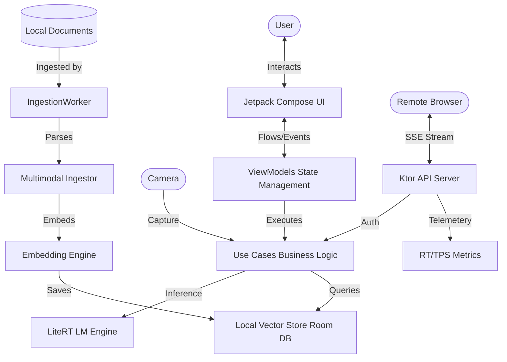
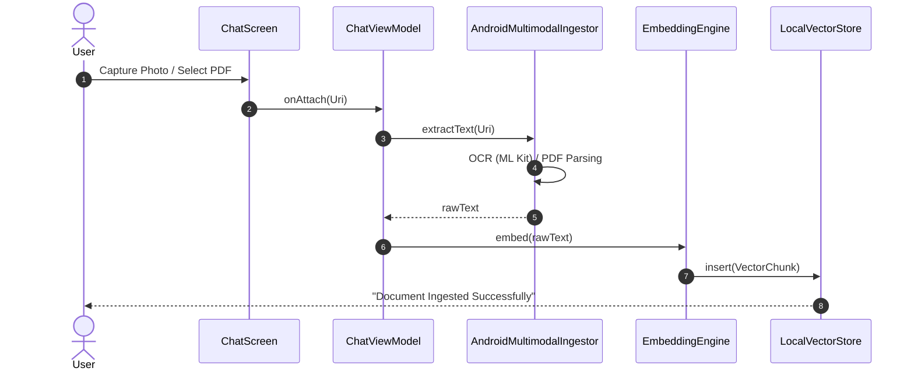

# Chhanda: Production-Grade On-Device AI with RAG

Chhanda is a 100% offline, privacy-first AI application designed for high-performance Retrieval-Augmented Generation (RAG) on Android. It utilizes **Gemma 4B & 2B (4-bit quantized)** orchestrated via **Google LiteRT-LM** (MediaPipe GenAI) and features a local multimodal ingestion pipeline.

---

## 🚀 Key Features

- **100% Offline Inference**: No data leaves the device; LLM execution is strictly local.
- **Multimodal Gateway**: Support for Text, Images (Direct Camera/Gallery), Audio, and PDF.
- **High-Precision RAG**: Semantic vector search with model-aware relevance thresholding.
- **Advanced Telemetry**: Real-time monitoring of **TPS (Tokens Per Second)** and **RT (Response Time)** for both local and web gateway sessions.
- **Personalized Voice AI**: 3 Male/3 Female styles including Indian voices (Arjun as Kallol, Priya as Chhanda).
- **Robust Ingestion**: Multi-strategy web scraping and local file processing with automated text chunking.
- **Security & Privacy**: Mandatory API key authentication for web access and zero-cloud data footprint.

---

## 🏛 1. High-Level Architecture

### 🗺 High-Level System Overview
Chhanda operates as a local AI gateway. It can serve the device user directly or act as a remote endpoint for other devices on the same network.

---

## 📂 2. Core Components

### 🔵 2.1 The Inference Engine (`LiteRTLMEngine.kt`)
The heart of Chhanda. It manages the lifecycle of the Gemma models.
- **Dynamic Memory Management**: Automatically scales context length (512 to 4096) based on available RAM to prevent OOM.
- **Thermal Safety**: Implements a 2500ms mandatory "cooldown" gap between model swaps to allow the OS to reclaim native RAM.
- **Thought Filtering**: Automatically strips internal `<thought>` blocks from streaming output to keep responses clean.

### 🟢 2.2 The RAG Pipeline (`ContextManager.kt` & `LocalVectorStore.kt`)
Chhanda uses a custom-built vector similarity search engine running on top of Room/SQLite.
- **Model-Aware Logic**: Gemma 4B uses a denser threshold (0.15) and smaller Top-K (3) for speed, while 2B uses a broader search (0.02) for better recall.
- **Embedding Alignment**: Uses `sentence-transformers/all-MiniLM-L6-v2` equivalents via MediaPipe for 384-dimensional semantic vectors.

### 🟡 2.3 The Web Gateway (`ChhandaServer.kt`)
A Ktor-based server that turns the Android phone into a secure AI endpoint.
- **SSE Streaming**: High-fidelity event stream with metadata headers.
- **Telemetry Emission**: Emits `TPS:[val]` and `RT:[val]` signals for real-time frontend dashboarding.
- **API Key Security**: Rejects unauthorized requests with a 401 status.

---

## 🔄 3. Control Flow: Multimodal Ingestion

---

## 📄 4. Exhaustive File-by-File Analysis

### 📱 Presentation Layer
*   **`ui/ChatScreen.kt`**: Main interface. Handles camera intent, voice recording, and streaming telemetry bubbles.
*   **`ui/DashboardScreen.kt`**: Infrastructure control. Monitors RAM, Battery Temp, and Gateway Status.
*   **`viewmodel/SystemViewModel.kt`**: Orchestrates model discovery, downloads, and system-wide logging.

### 🧠 Domain Layer
*   **`usecase/SendMessageUseCase.kt`**: The "Senior Architect" orchestrator. Handles prompt construction, safety filtering, and load balancing.
*   **`domain/model/TokenUpdate.kt`**: Data class representing the streaming state (Partial/Final/Error/RT).

### 🛠 Data Layer
*   **`data/inference/LiteRTLMEngine.kt`**: Low-level JNI bindings to the LiteRT library.
*   **`data/repository/ChatDao.kt`**: Manages the message persistence and search history.
*   **`util/FileUtils.kt`**: Helpers for scoped storage, camera URI generation, and model verification.

---

## 🛑 5. Challenges & Architected Solutions

| Challenge | Solution |
| :--- | :--- |
| **Gemma 4B Latency** | Optimized RAG Top-K density and streamlined instructions for faster first-token emission. |
| **Native Memory Leaks** | Synchronized native engine teardown with mandatory `System.gc()` and thread-locking. |
| **Scraping Blockers** | Multi-strategy scraper with randomized Desktop User-Agents and Readability-based filtering. |
| **Model Discovery** | Robust filename fallback logic that identifies models by size and version tags (E2B/E4B). |

---

## 🛠 6. Tech Stack

- **Inference**: LiteRT (TensorFlow Lite GenAI)
- **Vision**: Google ML Kit OCR
- **Speech**: Android STT / Custom TTS Engine
- **Network**: Ktor (Server & Client)
- **Database**: Room (SQL + Vector)
- **UI**: Jetpack Compose (Material 3)

---

Developed with ❤️ by **Antigravity** for **Chhanda AI**.
