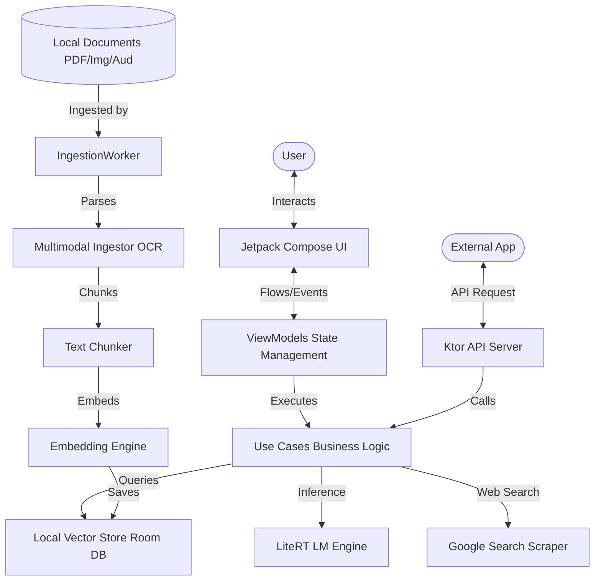
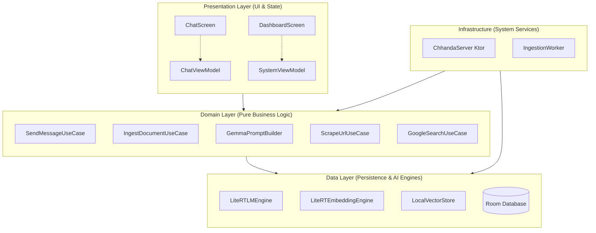
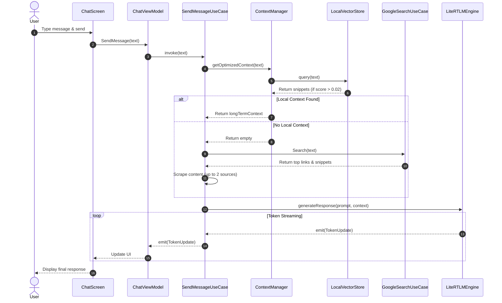

# Chhanda: Production-Grade On-Device AI with RAG

Chhanda is a 100% offline, privacy-first AI application designed for high-performance Retrieval-Augmented Generation (RAG) on Android. It utilizes **Gemma 2B (4-bit quantized)** orchestrated via **Google LiteRT-LM** (MediaPipe GenAI) and features a local multimodal ingestion pipeline.

---

## 🚀 Key Features
- **100% Offline Inference**: No data leaves the device; LLM execution is strictly local.
- **On-Device RAG**: Real-time vector similarity search for context-aware responses.
- **Multimodal Ingestion**: On-device OCR (Images), ASR (Audio), and PDF parsing.
- **Web Fallback**: Automatically falls back to Google Search when local knowledge is missing.
- **Pixel-Inspired Design**: Premium "Chromatic Architect" aesthetic with glassmorphism and tonal elevations.

---

## 🎭 Role & Purpose of this Document
This document is written from the perspective of a **Senior Architect**. It provides an exhaustive, file-by-file and layer-by-layer breakdown of the Chhanda application. It is designed to guide a junior developer through the complex interplay of local LLM inference, vector databases, and background processing on Android, enabling them to make fixes and scale the system confidently.

---

## 🏛 1. High-Level Architecture

### 🗺 High-Level System Overview
This diagram shows how the user, background processes, and external apps interact with the system.

---

## 📂 2. Layer-by-Layer Breakdown & Component Diagram

### 🧱 Component & Layer Interaction
This diagram illustrates the separation of concerns and how layers depend on each other. Dependency flows downwards.

---

## 📄 3. Exhaustive File-by-File Analysis

### 🔵 3.1 Presentation Layer
*   **`MainActivity.kt`**: Single Activity entry point. Hosts navigation.
*   **`ui/DashboardScreen.kt`**: The main control center (Model management, server status).
*   **`ui/ChatScreen.kt`**: Real-time streaming chat interface.
*   **`ui/ConfigScreen.kt`**: Settings panel (Context length, TurboQuant toggle).
*   **`ui/LogsScreen.kt`**: Real-time log viewer for debugging.
*   **`viewmodel/SystemViewModel.kt`**: Global state holder.

### 🟢 3.2 Domain Layer
*   **`usecase/SendMessageUseCase.kt`**: Orchestrates RAG and LLM inference.
*   **`usecase/ScrapeUrlUseCase.kt`**: Fetches content from a URL using `Jsoup`.
*   **`usecase/GoogleSearchUseCase.kt`**: Scrapes Google results for live web fallback.
*   **`model/ContextManager.kt`**: Orchestrates short-term and long-term memory.

### 🟡 3.3 Data Layer
*   **`inference/LiteRTLMEngine.kt`**: Core LLM runner (LiteRT/TFLite).
*   **`inference/LiteRTEmbeddingEngine.kt`**: Generates vectors using MediaPipe.
*   **`inference/AndroidMultimodalIngestor.kt`**: ML Kit OCR and file parsing.
*   **`inference/ChhandaServer.kt`**: Embedded Ktor server.
*   **`repository/LocalVectorStore.kt`**: Manual vector similarity search in Room.

---

## 🔄 4. Control Flow: Message Processing & RAG Fallback

---

## 🛠 5. Full Tech Stack & Library Details in Depth

| Category | Technology | Purpose in Chhanda |
| :--- | :--- | :--- |
| **LLM Inference** | **LiteRT-LM** | Google's edge inference engine for Gemma models. |
| **Embeddings** | **MediaPipe** | Generates vectors for RAG similarity search. |
| **OCR / Vision** | **Google ML Kit** | Extracts text from images and scanned PDFs. |
| **Local Database**| **Room (SQLite)** | Stores chat history and vector embeddings. |
| **API Server** | **Ktor** | Embedded HTTP server for external API access. |
| **Bg Tasks** | **WorkManager** | Handles model downloads and document ingestion. |
| **Scraping** | **Jsoup** | Used for web scraping and Google search fallback. |

---

## 🛑 6. Problems Faced & Overcome

### 🚨 1. Native C++ Engine "Busy" Deadlocks
*   **Solution**: Implemented a retry loop in `LiteRTLMEngine.kt` and strict calling of `session.close()`.

### 🚨 2. Out of Memory (OOM) on Low-RAM Devices
*   **Solution**: Dynamic context length scaling and mandatory `System.gc()` with a 2500ms delay.

### 🚨 3. RAG Hallucination & Low Recall
*   **Solution**: Lowered similarity threshold to `0.02` and implemented Web Search Fallback.

---

## 🚀 7. Optimization Techniques Used

1.  **Thermal Awareness**: Models are loaded lazily to minimize baseline memory footprint.
2.  **Token Budgeting**: RAG context is capped to fit model limits dynamically.
3.  **SIMD Math**: Vector similarity uses optimized loops for low-latency retrieval.
4.  **Lifecycle Safety**: Flows use `WhileSubscribed` to prevent background drain.
5.  **Prefix Hashing in Load Balancer**: Maintains cache locality for prompts.

---

Developed with ❤️ by **Antigravity** for **Chhanda AI**.
