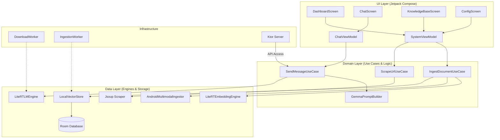

# Chhanda AI Gateway - Architectural Design

Chhanda is a production-grade, 100% offline RAG (Retrieval-Augmented Generation) system for Android. It enables users to interact with local LLMs (like Gemma) using their own documents, images, and web content as context.

## 🏛 High-Level Architecture

---

## 📂 Layer Breakdown

### 1. Presentation Layer (UI & State)
Responsible for the user interface, navigation, and reactive state management.
- **UI Components**: 
    - `MainActivity.kt`: Entry point and navigation host.
    - `DashboardScreen.kt`: Model management and system stats.
    - `ChatScreen.kt`: Real-time streaming chat interface.
    - `KnowledgeBaseScreen.kt`: Document and URL ingestion management.
    - `ConfigScreen.kt`: System settings (Context length, Auto-delete, API keys).
    - `LogsScreen.kt`: Real-time system telemetry and diagnostic logs.
    - `components/CommonUI.kt`: Shared premium design elements.
- **ViewModels**:
    - `SystemViewModel.kt`: Manages global app state, storage, and workers.
    - `ChatViewModel.kt`: Handles message flow and LLM interaction.

### 2. Domain Layer (Orchestration)
Contains pure business logic and use cases, decoupling the UI from data sources.
- **Use Cases**:
    - `SendMessageUseCase.kt`: Orchestrates retrieval from vector store and LLM inference.
    - `IngestDocumentUseCase.kt`: Handles file parsing, chunking, and embedding.
    - `ScrapeUrlUseCase.kt`: Robust web content extraction.
    - `GemmaPromptBuilder.kt`: Formats chat history and context for Gemma-style models.
- **Core Models**:
    - `LLMEngine.kt`: Abstraction for the inference backend.
    - `TextChunker.kt`: Logic for recursive character-based text splitting.
    - `ContextOptimizer.kt`: Truncates and prioritizes context to fit model limits.

### 3. Data Layer (Persistence & Inference)
Handles raw data operations, local databases, and native AI engine implementations.
- **Storage**:
    - `AppDatabase.kt`: Room database for chat history, file metadata, and vector chunks.
    - `SettingsRepository.kt`: DataStore for persistent configuration.
    - `LocalVectorStore.kt`: Implementation of similarity search over Room-stored embeddings.
- **AI Engines**:
    - `LiteRTLMEngine.kt`: Core LLM runner (LiteRT/TFLite) with GPU/CPU fallback.
    - `LiteRTEmbeddingEngine.kt`: MediaPipe-based embedding generator.
    - `AndroidMultimodalIngestor.kt`: ML Kit OCR and Android system parsers for PDF/Audio.
- **External Gateway**:
    - `ChhandaServer.kt`: Ktor-based local API server for network-based interaction.

### 4. Infrastructure & Services
System-level components for background execution and utility.
- **Workers**:
    - `DownloadWorker.kt`: Resumable background model downloads from HuggingFace.
    - `IngestionWorker.kt`: Heavy document processing in background threads.
- **Services**:
    - `ChhandaForegroundService.kt`: Persistent server execution with notification.
    - `ChhandaTileService.kt`: Quick Settings toggle for the AI server.
- **Utilities**:
    - `HotspotManager.kt`: Wi-Fi discovery and connectivity logic.
    - `FileUtils.kt`: Scoped storage and file finalization logic.

---

## 🛠 Tech Stack & Libraries

| Category | Technology |
| :--- | :--- |
| **Language** | Kotlin 2.1.0 / Coroutines / Flow |
| **UI Framework** | Jetpack Compose (BOM 2024.02.00) |
| **Dependency Injection** | Hilt 2.55 |
| **Inference Engine** | LiteRT-LM (TFLite) 0.11.0 |
| **Vector DB** | SQLite (Room) with manual Similarity Search |
| **AI Vision** | Google ML Kit (OCR) |
| **Networking** | Ktor (CIO Engine) |
| **Persistence** | Room 2.6.1 / DataStore 1.1.1 |
| **Background Tasks** | WorkManager 2.9.0 |
| **Scanning** | Jsoup (HTML) / ZXing (QR) |

---

## 🔒 Security & Privacy
- **100% Offline**: All data, including vector embeddings and model weights, stays on-device in private scoped storage.
- **API Security**: The Ktor gateway is protected by mandatory API Key authentication.
- **Network Privacy**: Zero tracking or telemetry sent to external servers.