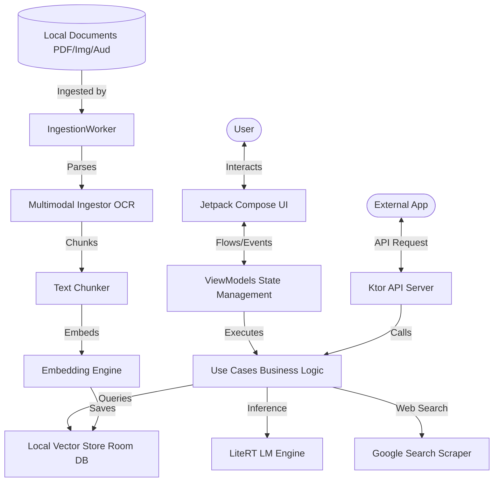
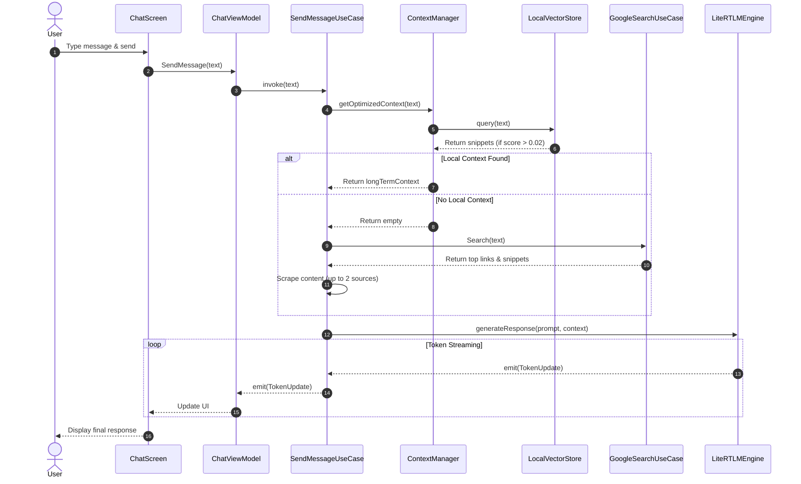
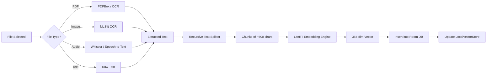

# Chhanda AI Gateway - Architectural Design & Developer Guide

## 🎭 Role & Purpose of this Document
This document is written from the perspective of a **Senior Architect**. It provides an exhaustive, file-by-file and layer-by-layer breakdown of the Chhanda application. It is designed to guide a junior developer through the complex interplay of local LLM inference, vector databases, and background processing on Android, enabling them to make fixes and scale the system confidently.

---

## 🏛 1. High-Level Architecture

Chhanda follows a strict **Clean Architecture** pattern combined with **MVI (Model-View-Intent)** principles in the presentation layer. It is 100% offline-first, meaning all inference and storage happen on the device.

### 🗺 High-Level System Overview
This diagram shows how the user, background processes, and external apps interact with the system.



---

## 📂 2. Layer-by-Layer Breakdown & Component Diagram

### 🧱 Component & Layer Interaction
This diagram illustrates the separation of concerns and how layers depend on each other. Dependency flows downwards.

```mermaid
graph TB
    subgraph "Presentation Layer (UI & State)"
        direction TB
        CS[ChatScreen]
        DS[DashboardScreen]
        CVM[ChatViewModel]
        SVM[SystemViewModel]
        CS -.-> CVM
        DS -.-> SVM
    end
    
    subgraph "Domain Layer (Pure Business Logic)"
        direction TB
        SMUC[SendMessageUseCase]
        IDUC[IngestDocumentUseCase]
        GSP[GemmaPromptBuilder]
        SUUC[ScrapeUrlUseCase]
        GSUC[GoogleSearchUseCase]
    end
    
    subgraph "Data Layer (Persistence & AI Engines)"
        direction TB
        LE[LiteRTLMEngine]
        EE[LiteRTEmbeddingEngine]
        LVS[LocalVectorStore]
        RD[(Room Database)]
    end
    
    subgraph "Infrastructure (System Services)"
        direction TB
        CServ[ChhandaServer Ktor]
        IW[IngestionWorker]
    end
    
    Presentation Layer --> Domain Layer
    Domain Layer --> Data Layer
    Infrastructure --> Domain Layer
    Infrastructure --> Data Layer
```

### 🔵 2.1 Presentation Layer Files
*   **`MainActivity.kt`**: Entry point, sets up Navigation graph.
*   **`ChatScreen.kt`**: Real-time streaming chat interface.
*   **`ConfigScreen.kt`**: Settings panel (Context length, TurboQuant toggle).
*   **`SystemViewModel.kt`**: Manages global state, storage, and workers.
*   **`ChatViewModel.kt`**: Handles message flow and LLM interaction.

### 🟢 2.2 Domain Layer Files
*   **`SendMessageUseCase.kt`**: Orchestrates retrieval and LLM inference.
*   **`ScrapeUrlUseCase.kt`**: Robust web content extraction.
*   **`GoogleSearchUseCase.kt`**: Performs Google search as a fallback.

### 🟡 2.3 Data Layer Files
*   **`LiteRTLMEngine.kt`**: Core LLM runner (LiteRT/TFLite) with memory management.
*   **`LocalVectorStore.kt`**: Similarity search over Room-stored embeddings.
*   **`SettingsRepository.kt`**: DataStore for persistent configuration.

---

## 🔄 3. Control Flow: Message Processing & RAG Fallback

This sequence diagram details the exact control flow when a user sends a message, showing the decision-making process for local RAG vs. Web Search fallback.



---

## 🏗 4. Low-Level Diagram: RAG Ingestion Pipeline

This diagram shows the low-level data transformation steps when a document is ingested into the system.



---

## 🛠 5. Edge Case Engineering: Overcoming Native & Hardware Limitations

### 🚨 Problem 1: Native C++ Engine "Busy" Deadlocks
*   **Symptom**: Inference engine remains busy after cancellation.
*   **Solution**: Implemented a retry loop in `LiteRTLMEngine.kt` (30 attempts, 400ms delay) and strict calling of `session.close()`.

### 🚨 Problem 2: Out of Memory (OOM) on Low-RAM Devices
*   **Symptom**: App crashes when loading large models.
*   **Solution**: Dynamic context length scaling (halving on failure) and mandatory `System.gc()` with a 2500ms delay before loading.

### 🚨 Problem 3: RAG Hallucination & Low Recall
*   **Symptom**: System says "I don't know" for available data.
*   **Solution**: Lowered similarity threshold to `0.02` and implemented the Google Search fallback detailed in the control flow.

---

## 👶 6. Guide for Junior Developers: How to Scale the App

### How to add a new Setting
1.  Add key in `SettingsRepository.kt` -> `PreferencesKeys`.
2.  Add flow/setter in `SettingsRepository.kt`.
3.  Expose in `SystemViewModel.kt`.
4.  Add UI in `ConfigScreen.kt`.

### How to debug Inference Issues
1.  Check the **Logs** screen in the app for `[INFERENCE]` tags.
2.  Errors in JNI callbacks must be caught aggressively in `LiteRTLMEngine.kt`.